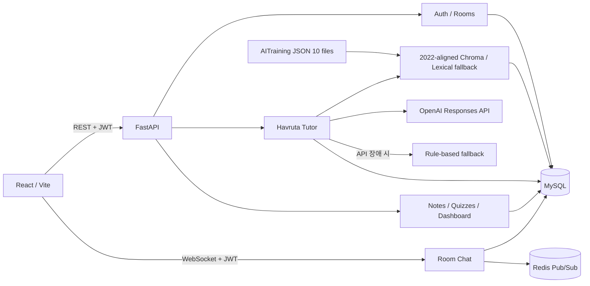

# Havruta AI Tutor

> 구조와 RAG 처리 흐름은 [프로젝트 구조 안내](docs/PROJECT_STRUCTURE.md)를 참고하세요.

> 전체 기획·구현·운영 설명서는 [`docs/PROJECT_MANUAL.md`](docs/PROJECT_MANUAL.md)를 참고하세요.

고등학생이 질문·설명·피드백을 반복하며 학습하는 하브루타 튜터 MVP입니다. 백엔드, AITraining 자료 처리 코드, React 프런트엔드를 현재 `main` 코드에 통합했습니다.

## 공개 테스트

- 웹앱: <https://frontend-production-8c41.up.railway.app>
- 백엔드 API: <https://backend-production-98f3.up.railway.app>
- Swagger 문서: <https://backend-production-98f3.up.railway.app/docs>

위 주소는 이 저장소에 기록된 Railway 배포 주소입니다. 배포 서비스가 실행 중이면 각 사용자가 직접 가입한 뒤 학습방 초대 코드로 함께 테스트할 수 있습니다.

## 구현된 기능

- 이메일 회원가입과 로그인, Argon2 비밀번호 해싱, JWT 인증
- 학습방 생성, 6자리 초대 코드 참여, 인원 제한
- 국어·영어·수학·사회·사회문화·과학·도덕·기술가정·정보 학습방 생성
- 하브루타 학습 세션 시작, 메시지 저장, 휴리스틱 응답 평가, 후속 질문
- 역할을 보존한 최근 대화와 5단계 학습 상태를 반영한 다회차 하브루타 응답
- `몰라`·힌트 요청은 오답이나 진도로 계산하지 않고 직전 질문을 더 쉽게 이어서 질문
- 진행 중인 학습 세션과 전체 메시지를 새로고침 후 자동 복원
- 답변별 실제 RAG 검색기·AI 제공자·성취기준·근거·혼합 관련도 표시
- 개념·근거·명료성·참여도의 설명 가능한 4영역 루브릭
- 저장소에 포함된 고1 수학 JSON 10건 자동 DB 인덱싱
- 2022 성취기준 연계 ChromaDB 의미 검색과 OpenAI 응답 생성
- 실제 Chroma 자료에서 생성한 학교급·학년·단원 선택 카탈로그
- 과목·학교급·학년·단원 서버 검증과 동일 범위의 Chroma 메타데이터 필터
- 학습 세션 종료, 평균 점수와 학습 기록 집계
- 학습 종료 시 정리노트 자동 생성
- RAG 자료 기반 복습 퀴즈 생성과 채점
- 누적 홈 통계, 최근 10개 학습 기록 기반 캘린더, 마이페이지 실데이터 연동
- React 회원가입/로그인, 학습방, AI 채팅, 노트, 퀴즈 UI
- JWT·학습방 권한 검사를 적용한 실시간 그룹 채팅과 메시지 이력
- 두 학생의 의견을 RAG 근거로 비교하는 공동 하브루타 분석
- Railway용 백엔드/프런트 Docker 배포, MySQL·Redis 연동 설정
- SQLite 단위·통합 테스트 및 실제 MySQL HTTP 스모크 테스트
- 발표용 시스템 준비 상태 API와 9개 과목 RAG 평가 스크립트
- 사용자별 AI 요청 한도와 응답 토큰 상한을 통한 공개 시연 비용 보호

## 아키텍처



`OPENAI_API_KEY`를 설정하면 선택한 학습방 과목의 검색 근거와 최근 학생·AI 대화를 역할별로 OpenAI Responses API에 전달합니다. API 키가 없거나 OpenAI 호출에 실패하면 세션이 멈추지 않도록 규칙 기반 답변으로 대체합니다. 외부 생성 모델 제공자는 OpenAI만 사용합니다. `RAG_PROVIDER=auto` 또는 `chroma`는 로컬 ChromaDB를 우선 사용하고, DB나 선택 패키지가 없으면 관계형 DB의 어휘 검색으로 대체됩니다. 모든 검색은 기본적으로 `RAG_CURRICULUM_YEAR=2022`와 선택한 학교급·학년·단원을 사용하며, 2022 원본 자료 또는 2022 성취기준이 매핑된 자료만 반환합니다.

## 현재 데이터 범위

- Git에 포함된 원본 RAG 자료는 `data/`의 고1 수학 JSON 10건입니다.
- `chroma_db/`는 대용량 인덱스라 Git과 Docker 이미지에서 제외됩니다. 로컬에서는 프로젝트의 인덱스를 사용하고, Railway에서는 백엔드 영속 볼륨의 `/data/chroma_db/chroma_db`를 사용합니다.
- 국어·영어·수학·사회·사회문화·과학·도덕·기술가정·정보 9개 과목에서 2022 성취기준 연계 검색을 검증했습니다.
- 학습과 퀴즈의 주제는 자유 입력하지 않습니다. `학교급 → 학년 → 단원`을 선택하며, 내부 단원 코드로 해당 단원의 RAG 자료만 검색합니다. 교육과정 코드 약어는 사용자 화면에 표시하지 않습니다.
- 해당 과목 RAG 자료가 없으면 화면에 상태를 알리고 학습 시작을 막아 일반 답변을 RAG 답변처럼 보이지 않게 합니다.
- 퀴즈는 선택한 과목에서 검색된 RAG 자료에 질문과 정답이 있을 때만 생성합니다. 자료가 없을 때 다른 과목 문제를 대신 만드는 폴백은 사용하지 않습니다.

## 빠른 실행

### 1. MySQL

```bash
brew services start mysql
```

데이터베이스와 애플리케이션 사용자를 최초 한 번 생성합니다.

```sql
CREATE DATABASE havruta_ai_tutor CHARACTER SET utf8mb4 COLLATE utf8mb4_unicode_ci;
CREATE USER 'havruta_app'@'localhost' IDENTIFIED BY '원하는_비밀번호';
GRANT ALL PRIVILEGES ON havruta_ai_tutor.* TO 'havruta_app'@'localhost';
```

### 2. 백엔드

```bash
python3 -m venv .venv
source .venv/bin/activate
pip install -r requirements.txt
test -f .env || cp .env.example .env
python -m scripts.migrate_schema
uvicorn main:app --reload --reload-dir app
```

백엔드 주소:

- API: <http://127.0.0.1:8000>
- Swagger: <http://127.0.0.1:8000/docs>

### 3. 프런트엔드

```bash
cd web
npm install
npm run dev -- --host 127.0.0.1
```

프런트 주소: <http://127.0.0.1:5173>

## Railway 배포

이 저장소에는 Railway가 직접 빌드할 수 있는 백엔드·프런트 Dockerfile과 배포 설정이 포함되어 있습니다. Railway 프로젝트에 `MySQL`, `Redis`, `Backend`, `Frontend` 네 서비스를 구성하면 됩니다.

전체 순서와 환경변수는 [`docs/RAILWAY_DEPLOYMENT.md`](docs/RAILWAY_DEPLOYMENT.md)를 따르세요. 백엔드는 배포 전에 스키마를 자동 생성·업그레이드하고, 프런트는 Railway의 공개 API 및 WebSocket 주소를 빌드 시 주입받습니다.

## 환경변수

| 이름 | 기본/예시 | 설명 |
|---|---|---|
| `DB_HOST` | `127.0.0.1` | MySQL 호스트 |
| `DB_PORT` | `3306` | MySQL 포트 |
| `DB_USER` | `havruta_app` | 애플리케이션 DB 사용자 |
| `DB_PASSWORD` | 필수 | DB 비밀번호 |
| `DB_NAME` | `havruta_ai_tutor` | DB 이름 |
| `DATABASE_URL` | Railway `MYSQL_URL` 참조 | 설정하면 개별 `DB_*`보다 우선 |
| `REDIS_URL` | Railway Redis URL | 다중 인스턴스 WebSocket 브로드캐스트 |
| `JWT_SECRET_KEY` | 필수 | 운영 시 긴 무작위 문자열 사용 |
| `CORS_ORIGINS` | `http://localhost:5173,...` | 허용할 프런트 주소 |
| `OPENAI_API_KEY` | 생성형 답변 사용 시 필수 | OpenAI API 키. Git에 커밋하지 않음 |
| `OPENAI_MODEL` | `gpt-5.6-terra` | 튜터 응답 생성 모델 |
| `OPENAI_REASONING_EFFORT` | `none` | 모델 추론 강도 |
| `OPENAI_TIMEOUT_SECONDS` | `45` | OpenAI 호출 제한 시간 |
| `OPENAI_MAX_OUTPUT_TOKENS` | `700` | 응답 한 건의 최대 출력 토큰 |
| `AI_REQUESTS_PER_MINUTE` | `12` | 사용자별 분당 AI 요청 한도 |
| `AI_REQUESTS_PER_DAY` | `200` | 사용자별 24시간 AI 요청 한도 |
| `RAG_PROVIDER` | `auto` | `chroma`, `auto` 또는 `lexical` |
| `RAG_CURRICULUM_YEAR` | `2022` | 모든 학습·퀴즈·검색에 적용할 교육과정 연도 |
| `CHROMA_DIR` | `chroma_db` | 로컬 ChromaDB 디렉터리 |
| `CHROMA_COLLECTION` | `havruta_math_all` | 검색할 컬렉션 |
| `RAG_MIN_SCORE` | `0.2` | 의미 검색의 최소 유사도 기준 |

## 주요 API

| 기능 | 메서드 | 경로 |
|---|---|---|
| 상태 확인 | GET | `/` |
| 회원가입 | POST | `/auth/signup` |
| 로그인 | POST | `/auth/login` |
| 내 정보 | GET | `/auth/me` |
| 내 학습방 | GET/POST | `/rooms` |
| 초대 코드 참여 | POST | `/rooms/join` |
| 세션 시작 | POST | `/sessions` |
| AI와 대화 | POST | `/sessions/{id}/messages` |
| 세션 종료 | POST | `/sessions/{id}/finish` |
| RAG 검색 | POST | `/rag/search` |
| 과목별 단원 카탈로그 | GET | `/rag/catalog?subject=수학` |
| 과목별 RAG 상태 | GET | `/rag/status?subject=수학` |
| 정리노트 | GET | `/notes` |
| 퀴즈 생성/목록 | POST/GET | `/quizzes` |
| 퀴즈 채점 | POST | `/quizzes/{id}/submit` |
| 내 학습 통계 | GET | `/dashboard/me` |
| 월별 실제 학습·노트 | GET | `/dashboard/calendar` |
| 공동 하브루타 분석 | POST | `/chat/rooms/{room_id}/ai-feedback` |
| 그룹 WebSocket | WS | `/chat/ws/{room_id}` |
| 그룹 채팅 이력 | GET | `/chat/rooms/{room_id}/messages` |
| 발표 준비 상태 | GET | `/health/ready` |

## 테스트

```bash
pip install -r requirements-dev.txt
pytest -q
npm --prefix web run build
python -m scripts.smoke_test
python -m scripts.evaluate_rag --per-subject 3 --top-k 3
```

- `pytest`: 인메모리 SQLite에서 API 흐름을 격리 검증합니다.
- `smoke_test`: 실행 중인 서버와 실제 MySQL을 사용하므로 개발 데이터가 생성됩니다.

## 선택적 임베딩 검색

기본 앱에는 대형 AI 패키지가 필요하지 않습니다. Chroma와 multilingual-e5 임베딩 실험을 실행할 때만 다음을 설치합니다.

```bash
pip install -r requirements-ai.txt
python -m scripts.verify_chroma
python -m scripts.evaluate_rag --per-subject 3 --top-k 3
```

`intfloat/multilingual-e5-base` 모델은 최초 실행 시 별도 다운로드되므로 네트워크와 수백 MB 이상의 여유 공간이 필요할 수 있습니다.

로컬 실행 시 프로젝트 루트의 `.env`에 새 API 키를 입력합니다.

```dotenv
OPENAI_API_KEY=새로_발급한_API_키
RAG_PROVIDER=chroma
```

Railway에서는 백엔드 서비스의 `Variables`에 같은 변수들을 추가합니다. 로컬 `chroma_db/`는 Git에서 제외되므로 Railway에 별도 저장소를 구성하지 않으면 배포 서버는 자동으로 MySQL 어휘 검색을 사용합니다.

## 프로젝트 구조

```text
havruta-ai-tutor/
├── app/                       # 애플리케이션
│   ├── rag/                   # RAG 핵심
│   │   ├── retriever.py        # 자료 인덱싱·임베딩·벡터/어휘 검색
│   │   ├── tutor.py            # 프롬프트·대화 흐름·OpenAI 응답
│   │   └── curriculum.py       # 과목·학년·단원 카탈로그
│   ├── resources/             # 교육과정 카탈로그 JSON
│   ├── routers/               # 인증·학습·RAG·채팅 API
│   ├── services/              # 노트·퀴즈·공동 학습·실시간 연결
│   ├── models/                # DB 테이블
│   ├── schemas/               # 요청 데이터 검증
│   ├── database/              # 환경변수·DB 연결
│   └── utils/                 # JWT·비밀번호 처리
├── data/                      # RAG 원본 샘플
├── chroma_db/                 # 기존 벡터 인덱스 (Git 제외)
├── scripts/                   # 카탈로그 생성·마이그레이션·RAG 평가
├── tests/                     # 자동 테스트
├── web/                       # React 화면·API 클라이언트
├── docs/                      # 설계·사용·배포 문서
├── main.py                    # FastAPI 시작점
├── .env.example               # 환경변수 예시
├── requirements*.txt          # 기본·AI·테스트 의존성
├── Dockerfile                 # 서버 이미지
└── railway.json               # 서버 배포 설정
```

졸업작품 보완 내용, 시연 순서와 실제 RAG 측정 결과는 [`docs/CAPSTONE_COMPLETION.md`](docs/CAPSTONE_COMPLETION.md)에 정리되어 있습니다.

## 운영 전 필수 작업

- `.env`의 JWT 키와 DB 비밀번호 교체
- `mysql_secure_installation` 실행 및 root 계정 보호
- Alembic 기반 정식 마이그레이션 체계 도입
- WebSocket 연결 제한, 메시지 신고·감사 정책 적용
- 프롬프트 인젝션 고도화, 로그인 제한, 감사 로그, 백업 정책 적용
- 현재 휴리스틱 응답 점수를 실제 교육 평가셋으로 검증
