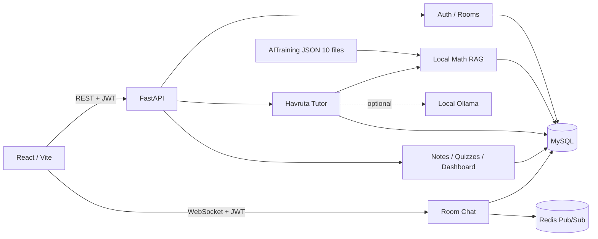

# Havruta AI Tutor

> 전체 기획·구현·운영 설명서는 [`docs/PROJECT_MANUAL.md`](docs/PROJECT_MANUAL.md)를 참고하세요.

고등학생이 AI와 질문·설명·피드백을 반복하며 학습하는 하브루타 튜터 MVP입니다. GitHub의 `main`, `AITraining`, `front` 브랜치를 하나의 `integration` 브랜치로 통합했습니다.

## 공개 테스트

- 웹앱: <https://frontend-production-8c41.up.railway.app>
- 백엔드 API: <https://backend-production-98f3.up.railway.app>
- Swagger 문서: <https://backend-production-98f3.up.railway.app/docs>

현재 Railway Hobby의 MySQL·Redis·Backend·Frontend 네 서비스가 실행 중입니다. 각 사용자가 웹앱에서 직접 가입한 뒤 학습방 초대 코드로 함께 테스트할 수 있습니다.

## 구현된 기능

- 이메일 회원가입과 로그인, Argon2 비밀번호 해싱, JWT 인증
- 학습방 생성, 6자리 초대 코드 참여, 인원 제한
- AI 학습 세션 시작, 메시지 저장, 답변 평가, 후속 질문
- `AITraining`의 고1 수학 자료 10건 자동 DB 인덱싱
- 가벼운 로컬 검색 기반 RAG와 선택적 Ollama 연동
- 학습 세션 종료, 평균 점수와 학습 기록 집계
- 학습 종료 시 정리노트 자동 생성
- RAG 자료 기반 복습 퀴즈 생성과 채점
- 홈 통계, 캘린더, 마이페이지 실데이터 연동
- React 회원가입/로그인, 학습방, AI 채팅, 노트, 퀴즈 UI
- JWT·학습방 권한 검사를 적용한 실시간 그룹 채팅과 메시지 이력
- Railway용 백엔드/프런트 Docker 배포, MySQL·Redis 연동 설정
- SQLite 단위·통합 테스트 및 실제 MySQL HTTP 스모크 테스트

## 아키텍처



현재 기본 `AI_PROVIDER=local`은 별도 모델 다운로드 없이 어휘 검색, 정답 핵심어 비교, 규칙 기반 피드백으로 작동합니다. `AI_PROVIDER=ollama`로 변경하면 RAG 근거를 포함한 프롬프트를 로컬 Ollama 모델에 전달합니다.

## 빠른 실행

### 1. MySQL

```bash
brew services start mysql
```

데이터베이스와 애플리케이션 사용자를 최초 한 번 생성합니다.

```sql
CREATE DATABASE havruta_ai_tutor CHARACTER SET utf8mb4 COLLATE utf8mb4_unicode_ci;
CREATE USER 'havruta_app'@'localhost' IDENTIFIED BY '원하는_비밀번호';
GRANT ALL PRIVILEGES ON havruta_ai_tutor.* TO 'havruta_app'@'localhost';
```

### 2. 백엔드

```bash
python3 -m venv .venv
source .venv/bin/activate
pip install -r requirements.txt
cp .env.example .env
python -m scripts.migrate_schema
uvicorn main:app --reload --reload-dir app
```

백엔드 주소:

- API: <http://127.0.0.1:8000>
- Swagger: <http://127.0.0.1:8000/docs>

### 3. 프런트엔드

```bash
cd my-app
npm install
npm run dev -- --host 127.0.0.1
```

프런트 주소: <http://127.0.0.1:5173>

## Railway 배포

이 저장소에는 Railway가 직접 빌드할 수 있는 백엔드·프런트 Dockerfile과 배포 설정이 포함되어 있습니다. Railway 프로젝트에 `MySQL`, `Redis`, `Backend`, `Frontend` 네 서비스를 구성하면 됩니다.

전체 순서와 환경변수는 [`docs/RAILWAY_DEPLOYMENT.md`](docs/RAILWAY_DEPLOYMENT.md)를 따르세요. 백엔드는 배포 전에 스키마를 자동 생성·업그레이드하고, 프런트는 Railway의 공개 API 및 WebSocket 주소를 빌드 시 주입받습니다.

## 환경변수

| 이름 | 기본/예시 | 설명 |
|---|---|---|
| `DB_HOST` | `127.0.0.1` | MySQL 호스트 |
| `DB_PORT` | `3306` | MySQL 포트 |
| `DB_USER` | `havruta_app` | 애플리케이션 DB 사용자 |
| `DB_PASSWORD` | 필수 | DB 비밀번호 |
| `DB_NAME` | `havruta_ai_tutor` | DB 이름 |
| `DATABASE_URL` | Railway `MYSQL_URL` 참조 | 설정하면 개별 `DB_*`보다 우선 |
| `REDIS_URL` | Railway Redis URL | 다중 인스턴스 WebSocket 브로드캐스트 |
| `JWT_SECRET_KEY` | 필수 | 운영 시 긴 무작위 문자열 사용 |
| `CORS_ORIGINS` | `http://localhost:5173,...` | 허용할 프런트 주소 |
| `AI_PROVIDER` | `local` | `local` 또는 `ollama` |
| `OLLAMA_BASE_URL` | `http://127.0.0.1:11434` | Ollama API |
| `OLLAMA_MODEL` | `qwen2.5:3b` | 로컬 생성 모델 |

## 주요 API

| 기능 | 메서드 | 경로 |
|---|---|---|
| 상태 확인 | GET | `/` |
| 회원가입 | POST | `/auth/signup` |
| 로그인 | POST | `/auth/login` |
| 내 정보 | GET | `/auth/me` |
| 내 학습방 | GET/POST | `/rooms` |
| 초대 코드 참여 | POST | `/rooms/join` |
| 세션 시작 | POST | `/sessions` |
| AI와 대화 | POST | `/sessions/{id}/messages` |
| 세션 종료 | POST | `/sessions/{id}/finish` |
| RAG 검색 | POST | `/rag/search` |
| 정리노트 | GET | `/notes` |
| 퀴즈 생성/목록 | POST/GET | `/quizzes` |
| 퀴즈 채점 | POST | `/quizzes/{id}/submit` |
| 내 학습 통계 | GET | `/dashboard/me` |
| 그룹 WebSocket | WS | `/chat/ws/{room_id}` |
| 그룹 채팅 이력 | GET | `/chat/rooms/{room_id}/messages` |

## 테스트

```bash
pytest -q
cd my-app && npm run build
python -m scripts.smoke_test
```

- `pytest`: 인메모리 SQLite에서 API 흐름을 격리 검증합니다.
- `smoke_test`: 실행 중인 서버와 실제 MySQL을 사용하므로 개발 데이터가 생성됩니다.

## 선택적 임베딩 검색

기본 앱에는 대형 AI 패키지가 필요하지 않습니다. Chroma와 multilingual-e5 임베딩 실험을 실행할 때만 다음을 설치합니다.

```bash
pip install -r requirements-ai.txt
python -m src.index_math_chroma
python -m src.query_math_chroma
```

`intfloat/multilingual-e5-base` 모델은 최초 실행 시 별도 다운로드되므로 네트워크와 수백 MB 이상의 여유 공간이 필요할 수 있습니다.

## 프로젝트 구조

```text
app/
├── database/       # MySQL 설정, 엔진, 세션
├── models/         # SQLAlchemy 도메인 모델
├── routers/        # 인증, 방, 세션, RAG, 노트, 퀴즈, 통계
├── schemas/        # 요청 검증 모델
├── services/       # RAG, 튜터 응답, 콘텐츠 생성
└── utils/          # 비밀번호와 JWT
data/               # AITraining 고1 수학 JSON
my-app/             # React/Vite 프런트엔드
scripts/            # DB 마이그레이션과 스모크 테스트
src/                # RAG CLI/Chroma 실험 도구
tests/              # API 자동화 테스트
```

## 운영 전 필수 작업

- `.env`의 JWT 키와 DB 비밀번호 교체
- `mysql_secure_installation` 실행 및 root 계정 보호
- Alembic 기반 정식 마이그레이션 체계 도입
- WebSocket 연결 제한, 메시지 신고·감사 정책 적용
- 프롬프트 인젝션, 요청 제한, 감사 로그, 백업 정책 적용
- 현재 규칙 기반 평가를 실제 교육 평가셋으로 검증
