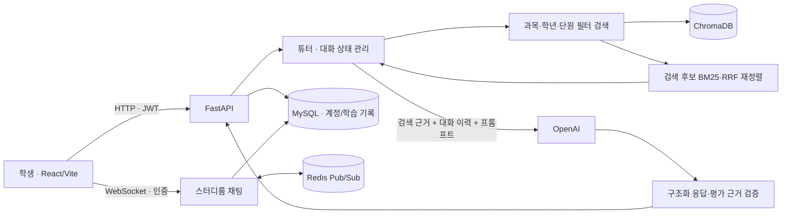

# Havruta AI Tutor

중·고등학생이 **자신의 설명 → AI의 질문·피드백 → 생각 수정**을 반복하는 RAG 기반 하브루타 학습 웹앱입니다. 단순 정답 제공보다, 근거를 설명하고 배운 내용을 새로운 상황에 적용하는 과정을 돕는 캡스톤 프로젝트입니다.

[웹앱](https://frontend-production-8c41.up.railway.app) · [API 문서](https://backend-production-98f3.up.railway.app/docs) · [발표 자료](docs/PRESENTATION_GUIDE.md) · [배포 안내](docs/RAILWAY_DEPLOYMENT.md)

> 배포 주소의 이용 가능 여부는 서비스 운영 상태에 따라 달라집니다. Git 저장소만 복제하면 운영 DB나 전체 ChromaDB 자료까지 내려받아지는 것은 아닙니다.

## 주요 기능

| 영역 | 구현 내용 |
| --- | --- |
| 계정 | 이메일 가입·로그인, 중1~고3 학년 선택, Argon2 비밀번호 해싱, JWT 인증 |
| 개인 학습 | 과목·학교급·학년·단원 선택, 이전 대화 이어하기, RAG 참고 자료 표시 |
| 대화와 진행 | 최근 대화와 학습 상태 반영, 개념·근거·생각 수정·적용·정리의 5단계 AI 확인 |
| 복습 | 학습 기록 기반 정리노트, RAG 자료 기반 3·5·10문항 퀴즈 선택 |
| 친구와 학습 | 초대 코드로 스터디룸 참여, WebSocket 채팅, 공동 하브루타 분석 |
| 학습 관리 | 홈 학습 플래너, 최근 학습 기록, 노트·퀴즈·스터디룸 삭제, 다크 모드 |

퀴즈 생성과 단원 선택은 실제 보유 자료에 영향을 받습니다. 표시되는 AI 확인은 잠정적인 학습 기록이며, 객관적 성적이나 학습효과의 증명이 아닙니다.

## 시스템 구성


```mermaid
flowchart LR
    Student["학생 · React/Vite"] -->|HTTP · JWT| API["FastAPI"]
    Student -->|WebSocket · 인증| Chat["스터디룸 채팅"]
    API --> Tutor["튜터 · 대화 상태 관리"]
    Tutor --> Search["과목·학년·단원 필터 검색"]
    Search --> Chroma[("ChromaDB")]
    Search --> Rank["검색 후보 BM25·RRF 재정렬"]
    Rank --> Tutor
    Tutor -->|검색 근거 + 대화 이력 + 프롬프트| LLM["OpenAI"]
    LLM --> Validate["구조화 응답·평가 근거 검증"]
    Validate --> API
    API --> DB[("MySQL · 계정/학습 기록")]
    Chat --> DB
    Chat <--> Redis[("Redis Pub/Sub")]
```

- **RAG**: ChromaDB 의미 검색으로 후보를 찾고, 후보 내 BM25 점수와 순위를 이용해 재정렬합니다. 전체 자료를 별도로 BM25 검색하는 구조는 아닙니다.
- **LLM**: 검색 자료와 최근 대화를 바탕으로 설명·후속 질문·학습 항목 평가를 생성합니다.
- **애플리케이션 로직**: 인증·접근 권한, 검색 범위, 대화 상태, 학생 발언 인용 및 출처 ID 검증, 기록 저장을 담당합니다. 질문 중복·단계 불일치에 대한 규칙 기반 보완도 남아 있습니다.
- **장애 대응**: Chroma 검색을 사용할 수 없으면 관계형 DB의 어휘 검색으로 대체합니다. OpenAI 생성 실패 시에는 기본 안내를 제공하며, 정상적인 AI 평가와 구분합니다.
- 개인 AI 대화는 HTTP, 친구 간 실시간 채팅은 WebSocket입니다. OpenAI 키는 백엔드에서만 사용합니다.

## 코드 탐색

```text
havruta-ai-tutor/
├── app/
│   ├── rag/
│   │   ├── retriever.py     # 인덱싱·벡터/어휘 검색
│   │   ├── reranker.py      # 검색 후보 재정렬
│   │   ├── tutor.py         # 프롬프트·OpenAI 호출·응답 검증
│   │   ├── dialogue.py      # 대화 의도·학습 단계·후속 질문 관리
│   │   └── curriculum.py    # 과목·학년·단원 카탈로그
│   ├── routers/            # 인증·학습·채팅 API
│   ├── services/           # 노트·퀴즈·실시간 연결
│   ├── models/             # 관계형 DB 모델
│   ├── schemas/            # 요청·응답 스키마
│   ├── database/           # 환경설정·DB 연결
│   ├── resources/          # 교육과정 카탈로그
│   └── utils/              # 인증 유틸리티
├── web/                    # React 화면·API 클라이언트
├── data/                   # Git에 포함된 수학 JSON 샘플 10건
├── scripts/                # 데이터 확인·카탈로그 생성·평가 도구
├── tests/                  # API·RAG·대화 상태 회귀 테스트
├── docs/                   # 설계·발표·배포 문서
├── main.py                 # FastAPI 진입점
├── .env.example            # 비밀 값 없는 환경설정 예시
├── requirements*.txt       # 기본·AI·개발 의존성
├── Dockerfile              # 백엔드 이미지
└── railway.json            # 백엔드 배포 설정
```

전체 흐름은 [프로젝트 구조](docs/PROJECT_STRUCTURE.md), 화면 코드는 [프런트엔드 안내](web/README.md)를 참고하세요.

## 로컬 실행

Python 3.11과 Node.js 22 환경을 기준으로 안내합니다. 아래는 **SQLite와 소량 샘플을 사용하는 개발 실행**이며, 운영 환경의 전체 과목 검색을 재현하지 않습니다.

### 1. 백엔드

```bash
python3 -m venv .venv
source .venv/bin/activate
python -m pip install -r requirements.txt
test -f .env || cp .env.example .env
```

`.env`에서 `JWT_SECRET_KEY`를 임의의 충분히 긴 값으로 바꿉니다. OpenAI 대화를 사용하려면 `OPENAI_API_KEY`를 설정합니다. API 사용에는 별도 비용이 발생할 수 있습니다.

```bash
DATABASE_URL=sqlite:///./havruta-local.db RAG_PROVIDER=lexical REDIS_URL= \
  python -m uvicorn main:app --reload --reload-dir app
```

기본 API 문서: <http://127.0.0.1:8000/docs>. 키가 없으면 AI 생성 대신 기본 안내가 표시됩니다. Redis 없는 로컬 실행에서는 프로세스 내부 채팅 연결만 사용합니다.

### 2. 프런트엔드 — 새 터미널

```bash
cd web
npm ci
test -f .env || cp .env.example .env
npm run dev -- --host 127.0.0.1
```

브라우저에서 <http://127.0.0.1:5173>을 엽니다. 프런트엔드 환경변수에 OpenAI 키나 DB 비밀번호를 넣지 마세요.

### 3. 전체 RAG·운영 DB 사용

- MySQL 접속 정보는 루트 `.env`의 `DATABASE_URL` 또는 `DB_*` 항목으로 설정합니다. 위 SQLite 명령의 환경변수 덮어쓰기 없이 서버를 실행해야 합니다.
- ChromaDB 검색에는 `requirements-ai.txt`의 추가 패키지, 별도 Chroma 인덱스, 임베딩 모델 캐시가 필요합니다.
- 기본 설정은 임베딩 모델의 로컬 파일만 사용하므로, 패키지 설치만으로 모델과 학습 자료가 준비되지는 않습니다.
- `CHROMA_DIR`, `CHROMA_COLLECTION`, `EMBEDDING_MODEL`은 인덱스를 만든 환경과 일치시켜야 합니다.
- `chroma_db/`는 Git과 Docker 빌드에서 제외합니다. 운영 환경에서는 영속 볼륨에 별도로 준비합니다.

자세한 환경변수는 [.env.example](.env.example), MySQL·Redis·볼륨 설정은 [운영 설명서](docs/PROJECT_MANUAL.md)와 [Railway 배포 안내](docs/RAILWAY_DEPLOYMENT.md)를 참고하세요.

## 검증 명령

```bash
python -m pip install -r requirements-dev.txt
python -m pytest tests/test_assessment_repair.py tests/test_dialogue_state.py tests/test_learning_report.py
npm --prefix web run lint
npm --prefix web run build
```

위 Python 명령은 평가 응답 복구·대화 상태·학습 진행의 **선별 회귀 검사**입니다. 전체 테스트, 실제 OpenAI 응답 품질 평가, 배포 환경 검증을 대신하지 않습니다. 외부 API를 사용하는 평가 도구는 비용·데이터 변경 여부를 확인한 후 별도로 실행하세요.

## 데이터와 평가의 한계

- 전체 ChromaDB와 운영 사용자 기록은 이 저장소에 포함되지 않습니다. `data/`의 10건 샘플과 운영 자료를 혼동하지 마세요.
- 카탈로그에는 국어·영어·수학·사회·사회문화·과학·도덕·기술가정·정보를 다루지만, 모든 단원에 충분한 자료가 있다는 뜻은 아닙니다.
- 검색 점수는 문서 정렬용 내부 값이지 답변의 정답 확률이 아닙니다. 사용자 화면의 정확도 퍼센트로 표현하지 않습니다.
- 출처 ID·학생 발언 인용 검증만으로 답변의 사실성이나 추론 정확성을 보장할 수 없습니다.
- 재정렬·대화 상태 관리가 구현되어 있어도, 정확도 향상률이나 학습효과는 별도 비교 평가 없이는 주장하지 않습니다.

## 문서 바로가기

| 목적 | 문서 |
| --- | --- |
| 구조 파악 | [프로젝트 구조](docs/PROJECT_STRUCTURE.md) · [아키텍처](docs/ARCHITECTURE.md) |
| 사용·운영 | [프로젝트 설명서](docs/PROJECT_MANUAL.md) · [Railway 배포](docs/RAILWAY_DEPLOYMENT.md) |
| 구현 개선과 한계 | [검색·대화 개선 기록](docs/RAG_DIALOGUE_IMPROVEMENTS.md) |
| 발표 준비 | [발표 자료](docs/PRESENTATION_GUIDE.md) · [기술 질의응답](docs/PRESENTATION_QA_TECH.md) |
| 교수 피드백 대응 | [캡스톤 1주차 대응](docs/CAPSTONE_WEEK1_RESPONSE.md) |

상세 문서에는 작성 당시의 구현·검증 기록이 포함됩니다. 현재 동작을 확인할 때는 관련 코드와 설정도 함께 확인하세요.
