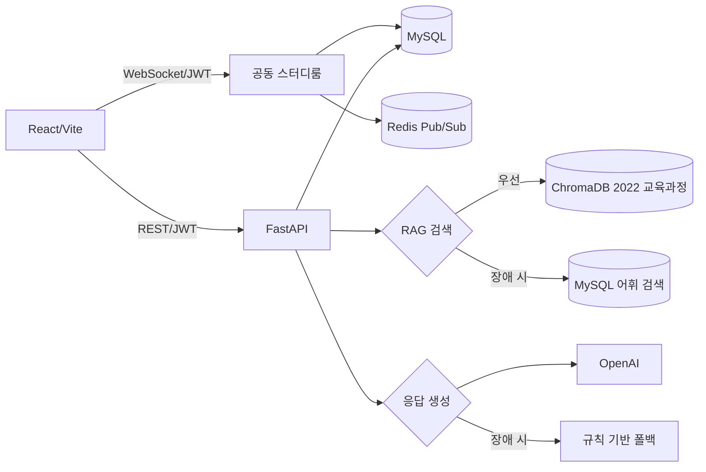
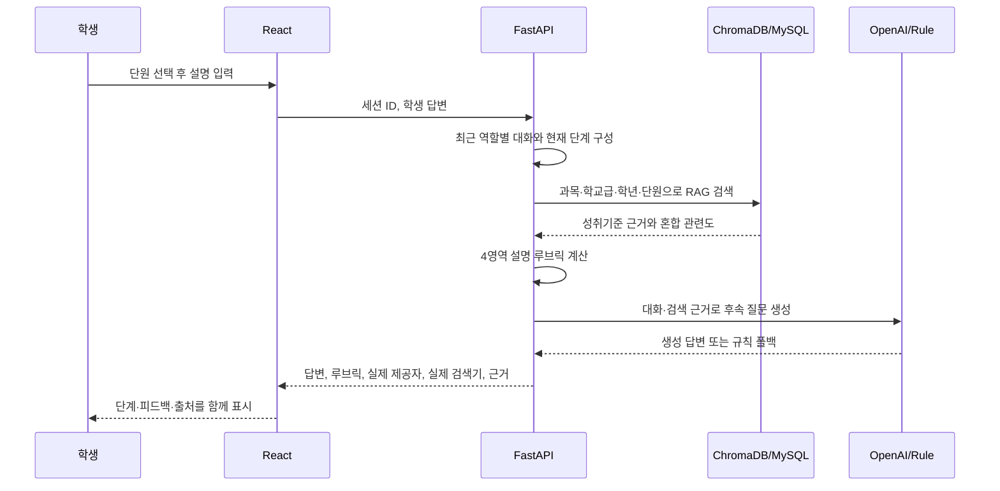

# 하브루타 AI 튜터 졸업작품 완성도 보완 보고서

## 1. 보완 목적

이 문서는 상용 출시가 아니라 졸업작품 평가를 목표로, 기능의 수보다 기술적 타당성·데이터 연결성·시연 안정성·검증 가능성을 높인 결과를 정리한다. 핵심 차별점은 2022 교육과정 단원으로 제한한 RAG 검색, 단계형 하브루타 대화, 설명 루브릭, 두 학생의 공동 토론 분석이다.

## 2. 최종 구현 범위

| 영역 | 기존 한계 | 보완 결과 |
|---|---|---|
| AI 학습 | 마지막 답변 중심, 근거 비공개 | 학생·AI 역할을 보존한 최근 10개 대화를 전달하고 현재 하브루타 단계와 RAG 근거를 답변별로 공개 |
| 대화 연속성 | 짧은 답변에서 다른 문제로 전환 가능 | 직전 AI 질문을 검색어와 프롬프트에 고정하고 `몰라`는 같은 질문의 힌트로 이어가며 새로고침 후 진행 세션·메시지·RAG 근거 복원 |
| 학년 분리 | 단원 코드만 사용해 같은 코드의 다른 학년 자료가 섞일 수 있음 | 과목·학교급·학년·단원 조합을 서버 카탈로그로 검증하고 Chroma 메타데이터까지 동일하게 제한 |
| 응답 평가 | 길이·키워드 기반 단일 점수 | 개념 40점, 근거·추론 30점, 명료성 20점, 참여도 10점의 설명 가능한 루브릭과 3단계 수준 제공 |
| RAG 투명성 | 검색 여부를 사용자가 확인하기 어려움 | ChromaDB·어휘 검색, OpenAI·규칙 폴백, 성취기준·근거·혼합 관련도를 화면에 표시 |
| 정리노트 | 학생 답변을 그대로 나열 | 학습 개요, 핵심 설명, 잘한 점, 보완 개념, 학습 결과, 교육과정 근거, 복습 질문으로 구조화 |
| 퀴즈 | 다른 문항의 정답을 단순 오답으로 사용 | 동일 질문의 유사 정답을 제외하고 관련도가 있는 다른 개념과 개념 반전 오답을 조합하며 4개 선택지의 중복을 차단 |
| 대시보드 | 메시지 수를 학습 성과처럼 표시 | 완료 세션·단원·퀴즈, 설명 수준, 강점·복습 주제를 실제 기록에서 계산 |
| 캘린더 | 최근 10개 기록과 임의 노트 제목 사용 | 월별 API에서 전체 학습 기록과 실제 생성 노트 ID·제목을 조회 |
| 스터디룸 | 일반 실시간 채팅 | 두 명 이상의 의견을 단원 RAG와 비교해 공통점·차이·후속 질문을 생성하는 공동 하브루타 분석 추가 |
| 오류 대응 | 화면 초기화 중심 | 요청 시간 제한, 네트워크·서버 오류 구분, 채팅 입력 복구, 세션 자동 복원, 화면 재시도와 로그인 초기화를 분리 |
| 운영 보호 | 공개 테스트 시 AI 호출 상한 없음 | 사용자별 분당 12회·일일 200회, 응답당 최대 700토큰 제한과 HTTP 429 재시도 안내 적용 |
| 발표 점검 | 개별 기능을 수동 확인 | 상태 진단 API와 전체 사용자 흐름을 검증하는 스모크 테스트 추가 |

## 3. 핵심 아키텍처



### 학습 응답 흐름



## 4. 하브루타 학습 단계

의미 있는 사용자 설명 횟수에 따라 `개념 설명 → 근거 확인 → 생각 수정 → 적용 → 최종 정리` 단계로 진행한다. 생성 모델에는 최근 학생·AI 대화를 역할별로 전달한다. RAG 재검색에도 직전 AI 질문을 포함하며, `몰라`, `모르겠어`, `힌트`처럼 정보가 적은 답변은 오답 점수나 진도 진행에서 제외한다. 이때 다른 문제로 전환하지 않고 같은 개념을 쉬운 힌트와 작은 질문으로 나눈다. 진행 중인 세션과 메시지는 MySQL에서 다시 불러오므로 새로고침 후에도 대화를 이어갈 수 있다. OpenAI API 키가 없거나 호출에 실패하면 같은 RAG 결과와 루브릭을 사용해 규칙 기반 답변을 반환하므로 세션이 중단되지 않는다.

루브릭 점수는 학업 성취도나 시험 점수가 아니라 설명 품질을 분석하기 위한 프로젝트 내부 지표다.

| 평가 영역 | 배점 | 판단 요소 |
|---|---:|---|
| 개념 정확성 | 40 | RAG 정답 핵심어와 학생 설명의 일치 |
| 근거·추론 | 30 | 이유, 조건, 예시, 수식·수치의 사용 |
| 설명 명료성 | 20 | 충분한 문장 길이와 완결성 |
| 학습 참여도 | 10 | 핵심어 수와 적용 예시·질문 사용 |

## 5. 공동 하브루타

스터디룸 참여자들이 의견을 남기고 학교급·학년·단원을 선택하면 `/chat/rooms/{room_id}/ai-feedback`이 최근 30개 메시지를 분석한다. 서로 다른 두 명 이상인지 권한과 참여 조건을 검사한 뒤 참여자별 핵심 의견, 공통 핵심어, 관점 비교, 다음 토론 질문과 RAG 근거를 반환한다. Redis가 연결되지 않아도 단일 백엔드 WebSocket으로 발표 시연이 가능하다.

## 6. 발표 안정성 기능

### 상태 진단

- `GET /health/live`: Railway 프로세스 상태 확인
- `GET /health/ready`: MySQL, ChromaDB/어휘 폴백, 생성 모델/규칙 폴백, Redis/WebSocket 폴백 상태 확인
- 설정 화면: 위 상태를 사용자에게 데이터베이스·RAG·AI·실시간 채팅 네 항목으로 표시
- Railway healthcheck: `/health/live` 사용
- 공개 시연 비용 보호: 사용자별 분당 12회·일일 200회, 응답 최대 700토큰

### 전체 스모크 테스트

`backend/scripts/smoke_test.py`는 다음을 한 번에 확인한다.

1. 서버 준비 상태
2. 학생 두 명 회원가입
3. 학습방 생성과 초대 코드 참여
4. 두 사용자의 WebSocket 메시지 저장
5. 공동 하브루타 AI 분석
6. 단원 RAG 학습과 근거 반환
7. 4영역 피드백
8. 학습 종료와 구조화 정리노트
9. 중복 없는 4지선다 퀴즈
10. 대시보드와 실제 월별 캘린더

로컬 서버 점검:

```bash
python -m scripts.smoke_test
```

Railway 백엔드 점검:

```bash
HAVRUTA_API_URL=https://backend-production-98f3.up.railway.app python -m scripts.smoke_test
```

스모크 테스트는 실제 회원·방·학습 기록을 생성하므로 발표 직전 점검용으로 사용한다.

## 7. RAG 객관 평가

`backend/scripts/evaluate_rag.py`는 실제 카탈로그에서 과목별 성취기준을 고르게 선택하고, 과목·학교급·학년·단원으로 제한된 검색 결과 상위 K개에 목표 성취기준이 포함되는지 측정한다. 검색 순위는 임베딩 의미 유사도 65%와 질의 핵심어 포함률 35%를 결합한다.

```bash
python -m scripts.evaluate_rag --per-subject 3 --top-k 3
```

2026-09-04 로컬 ChromaDB 측정 결과:

| 지표 | 결과 |
|---|---:|
| 평가 과목 | 9개 |
| 평가 질의 | 27개 |
| Hit@3 | 100% |
| 2022 교육과정 정렬률 | 100% |
| 평균 검색시간 | 2,368.0ms |
| 전체 평가시간 | 63.94초 |

9개 과목에서 과목당 3개씩 총 27개 성취기준을 평가해 모두 상위 3개에 포함됐고, 반환 문서의 교육과정 정렬률도 100%였다. 이는 성취기준 문장을 질의로 사용한 검색 무결성 평가 결과이며, 실제 학생 자유 질문의 교육적 적절성에 대한 교사 평가는 별도로 필요하다.

## 8. 자동 검증 명령

저장소 루트에서 실행한다. 다른 절의 `python -m scripts.*` 명령은 가상환경을 활성화한 `backend/` 디렉터리 기준이다.

```bash
.venv/bin/python -m pip install -r backend/requirements-dev.txt
.venv/bin/python -m pytest backend -q

cd frontend
npm ci
npm run lint
npm run build
```

백엔드 테스트는 인증, 세션, RAG, Chroma 장애 후 어휘 폴백, 구조화 노트, 월별 캘린더, 퀴즈, WebSocket, 두 사용자 공동 하브루타, 생성 모델 장애 후 규칙 폴백을 검증한다.

최종 검증 결과는 백엔드 자동 테스트 21개 통과, ESLint 통과, Vite 프로덕션 빌드 성공이다. 테스트에는 역할별 대화 문맥, `몰라` 단계 유지, 세션 복원, 학년 필터, 잘못된 교육과정 조합 차단, AI 요청 제한도 포함한다. 별도 임시 SQLite 서버를 실행한 실제 HTTP·WebSocket 스모크 테스트에서도 공동 참여자 2명, RAG 근거 3개, 정리노트 8개 섹션, 퀴즈 3문항, 캘린더 기록까지 전 구간 `PASS`를 확인했다.

## 9. 발표 권장 순서

1. 설정 화면에서 MySQL·RAG·AI·실시간 채팅 상태를 보여준다.
2. 수학 학습방에서 `고등학교 → 1학년 → 직선의 방정식`을 선택한다.
3. 학생 답변 후 하브루타 단계와 네 영역 루브릭을 보여준다.
4. 답변 아래 근거를 펼쳐 ChromaDB, 2022 성취기준, 혼합 관련도를 설명한다.
5. 학습을 종료하고 구조화 정리노트와 실제 캘린더 기록을 확인한다.
6. 같은 단원의 RAG 퀴즈를 생성하고 채점한다.
7. 두 브라우저 계정으로 스터디룸에 의견을 남긴 뒤 공동 하브루타 분석을 실행한다.
8. 마지막으로 OpenAI를 사용하지 않아도 규칙 기반 폴백으로 학습이 계속됨을 설명한다.

## 10. 프로젝트 정리·최적화

- 현재 실행 경로에서 사용되지 않던 `src/` 수학 전용 초기 실험 코드를 제거했다.
- RAG 평가는 `backend/scripts/evaluate_rag.py`로 통합했다.
- 테스트 전용 `pytest`, `httpx`를 `requirements-dev.txt`로 분리해 운영 이미지 의존성을 줄였다.
- 프런트에서 사용하지 않던 `react-router-dom` 의존성을 제거했다.
- Python 캐시, pytest 캐시, 프런트 빌드 결과, macOS 메타파일을 제거했다.
- `.venv`, `node_modules`, 원본 `data`, 전 과목 `chroma_db`는 로컬 실행에 필요하므로 유지했다.

## 11. 남은 한계

- 설명 루브릭은 규칙 기반 프로젝트 지표이며 교사의 성취도 평가를 대체하지 않는다.
- ChromaDB 파일은 Git에 포함되지 않으므로 Railway 영속 볼륨이 필요하다.
- 공동 하브루타 분석 결과는 현재 별도 테이블에 저장하지 않는다.
- 상용 서비스가 아니므로 결제, 소셜 로그인, 이메일 인증, 푸시 알림은 구현 대상에서 제외했다.
