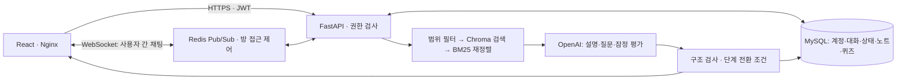

# 캡스톤 1주차 피드백 대응 — B-4조 (기존 A-1조)

기준: 2026-09-11 구현. 실제 배포 확인 결과는 `RELEASE_VALIDATION.md`에 기록한다.

## 1. 교수님 질문에 대한 답변 리스트

### Q1. AI로 만든 결과물 외에 팀이 직접 한 일은 무엇인가요?

“서비스의 문장 생성에는 OpenAI를 사용했고, 개발 과정에도 AI 코딩 도구의 도움을 받았습니다.
프로젝트에는 학생의 인증과 권한, 교육 자료의 검색 범위, 대화 상태와 단계 전환, 학습 기록과 복습 결과를
연결하는 애플리케이션 코드가 있습니다. 팀의 직접 기여는 그중 실제로 요구사항을 정하고 설계 대안을 비교하고
코드를 검토·수정하며 테스트한 기록을 근거로 설명하겠습니다.”

주의: 저장소만으로 각 팀원이 실제 수행한 일을 확정할 수 없다. 아래 표의 마지막 칸은 팀원이 실제 기록을 붙여야 한다.
AI가 생성한 코드를 모두 직접 작성했다고 하거나 코드 줄 수·커밋 작성자를 인간의 기여 비율로 제시하지 않는다.

| 팀이 설명해야 할 영역 | 구현 근거 | 발표 전에 팀이 붙일 증거 |
| --- | --- | --- |
| 요구사항: 고등학생 중심 설명·질문·복습 흐름 | 학습 시작/대화/종료 화면 | 회의록·시나리오·요구사항 결정자 |
| 데이터 모델·권한 경계 | `app/models`, `app/dependencies.py`, 소유권 테스트 | ERD 변경 이유·권한 실패 재현 기록 |
| 검색 범위·재정렬 선택 | `app/rag/retriever.py`, `reranker.py` | 비교한 대안·채택 이유·실패 사례 검토 |
| 학습 단계 전환·이어하기 | `app/rag/dialogue.py`, `app/routers/sessions.py` | 상태 전환 규칙 설명·재현 영상 |
| 배포·장애 대응 | Dockerfile, Railway 설정, smoke 스크립트 | 실제 빌드 오류·수정·배포 확인 기록 |
| AI 사용 내역 | AI 보조 코드·프롬프트·평가 초안 | 생성/수정/검토 범위와 담당자 |

### Q2. 데이터 편향은 어떻게 해결하나요?

“완전히 제거했다고 주장하지 않습니다. 과목·학년·단원별 분포와 메타데이터를 점검하고,
부족한 범위와 검토가 필요한 자료를 드러내는 방향으로 대응합니다. 검색에는 과목·학교급·학년·단원 필터를 적용하고,
도덕·사회는 특정 의견에 동의했는지보다 근거와 반례 검토를 중심으로 피드백하도록 했습니다.”

추가한 `python -m scripts.audit_curriculum`은 기존 카탈로그를 변경하지 않고 분포와 검토 대상을 출력한다.
이번 실행에서 학교급과 성취기준 코드 접두어의 조합을 사람이 확인해야 할 항목 **43개**를 찾았다.
이는 **확정 오류 43건이나 고유 문서 43건이 아니다**. 사람이 원본 교육과정과 대조한 뒤 수정/제외해야 한다.
문서가 여럿의 성취기준에 연결되므로 아래 수치 역시 고유 문서 수가 아니다.

| 과목 | 카탈로그의 문서-성취기준 연결 수 |
| --- | ---: |
| 국어 | 74,652 |
| 영어 | 78,264 |
| 수학 | 42,350 |
| 사회 | 26,730 |
| 사회문화 | 19,023 |
| 과학 | 12,228 |
| 도덕 | 32,233 |
| 기술가정 | 48,241 |
| 정보 | 24,403 |

후속 대응: 원본 출처·이용조건 확인 → 과목별 표본 검수 → 누락/불일치 목록 확정 → 수정본 재색인 → 평가셋 재검증.
특정 과목 자료를 복제해 수량만 맞추는 것은 품질 개선이 아니다. 학년 구분도 출처 메타데이터와 실제 편성의 일치를 검토해야 한다.

### Q3. 관련도 55%면 정확도가 55%인가요?

“아닙니다. 과거 퍼센트는 문서를 정렬하는 내부 검색 점수를 백분율로 표시한 값이었습니다.
정답 확률로 보정하거나 검증한 수치가 아니므로 답변 정확도로 해석할 수 없습니다.”

기존 Chroma 검색 점수는 의미 유사도 0.65와 어휘 겹침 0.35를 조합한다. 이번 BM25 재정렬 점수는 별도 순위 신호다.
둘 다 답변 정확도·학습효과·관련 있을 확률이 아니다.

### Q4. 그러면 왜 퍼센트를 없앴나요? 성능을 숨긴 건가요?

“오해를 유발한 표시를 수정했습니다. 내부 점수와 순위는 유지하고, 학생 화면에는 참고 자료와 성취기준을 표시합니다.
퍼센트를 없앴다고 성능이 개선됐다고 주장하지 않습니다. 성능은 고정 평가셋에서 별도로 비교해야 합니다.”

`근거 3개`도 `참고 자료 3개`로 바꿨다. 검색된 문서 수만으로 답변 전체가 검증됐다는 인상을 주지 않기 위해서다.

### Q5. 사용자가 정말 필요로 하는 데이터가 쓰였나요?

“현재는 선택 범위의 자료를 검색해 후보 15개를 중복 제거·BM25 재정렬하고, 대화에 최종 3개를 제공합니다.
현재 주제와 핵심 질문을 검색에 사용하며 ‘몰라’ 같은 답변은 새 검색 주제로 쓰지 않습니다.
그러나 필터 통과와 높은 검색 순위만으로 교육적 적합성을 보증할 수 없어 별도 검토가 필요합니다.”

검토 기준: ① 학생 질문에 필요한가 ② 설명의 사실을 실제로 뒷받침하는가 ③ 학생 수준과 학습목표에 적합한가.
필요한 자료가 후보에 없으면 재정렬로 해결되지 않는다. 현재 출처 연결은 정답 내용의 자동 사실 검증이 아니다.

### Q6. 기존 챗봇보다 얼마나 좋나요?

“현재 기능 차이는 설명할 수 있지만, 우월하다는 실험 결과는 아직 없습니다.
같은 모델과 단원으로 일반 챗봇, RAG 적용, RAG와 대화 상태 관리 적용 조건을 비교할 계획입니다.”

현재 제공하는 비교 도구 `scripts/evaluate_reranking.py`는 사람이 관련 자료 ID를 판정한 후보셋에서
Precision@K·Hit@K·MRR@K와 재정렬 시간을 출력한다. 후보 고정 실험이므로 전체 검색이나 답변 정확도 평가와 다르다.
Ragas는 아직 도입·측정하지 않았다. `68% → 89%`, `환각 15% 감소` 같은 예시를 실적처럼 쓰지 않는다.

### Q7. 대화 품질은 무엇을 바꿨나요?

“핵심 질문·직전 질문·힌트 횟수·오개념·단계 전환의 근거를 DB에 저장해 이어갑니다.
학생 질문에는 먼저 답하고, 모르면 같은 개념을 쉽게 설명하도록 했습니다.
힌트 요청·맞장구·학생 질문만으로 다음 단계로 넘어가는 것은 서버가 제한합니다.”

AI 응답은 설명·후속 질문·평가를 구조화해서 받으며, 잘못된 형식이나 호출 실패에는 현재 단계를 유지한다.
자동 재시도로 프론트 요청 제한 시간을 초과하지 않도록 OpenAI SDK의 재시도를 끈다.
자연어로 생성한 모든 문장의 맥락 유지까지 보장하는 것은 아니므로 실제 다중 턴 검토가 필요하다.

### Q8. 학습할수록 심화 단계로 넘어가나요?

“개념 설명 → 근거 확인 → 생각 수정 → 적용 → 최종 정리로 진행합니다. 발언 횟수로 올리지 않고,
AI가 현재 질문을 이해했다고 판단하면서 실제 학생 답변의 인용과 검색 출처를 제시한 경우에만 한 단계 진행합니다.”

서버는 인용이 학생 답변에 있고 출처 ID가 실제 검색 결과에 존재하는지 검사한다.
이 검사는 **형식과 출처 존재 확인**이다. AI가 인용의 의미를 잘못 판단할 가능성은 남는다.
따라서 UI는 `AI 확인`/`미확인`으로 표시하고 검증된 숙달 확률로 표시하지 않는다.
현재 단계별 목표는 공통 학습 틀이므로 단원별 전문가 검토 목표와 독립 적용 문제로 확장해야 한다.

### Q9. 학습목표 달성 기능은 어디에 있나요?

“학습 중 ‘학습목표와 진행’에서 이번 대화의 핵심 질문과 단계별 목표를 볼 수 있습니다.
종료하면 확인된 항목, 학생 설명 근거, 처음·마지막 설명과 다음 복습 항목을 보여주며 정리노트에 저장합니다.”

이번에 추가: 목표별 결과 화면, 종료 결과, 상태 복원, 정리노트 연결.
수정한 오류: 점수가 없는 답변을 보완 필요로 간주하던 문제, 최종 단계 반복 시 초기 확인 근거가 사라지던 문제.

### Q10. 실제로 학습효과가 있나요?

“현재는 학습을 지원하는 기능과 기록을 구현하고 테스트했습니다. 실제 학생의 학습효과를 입증한 것은 아닙니다.
처음·마지막 설명은 성찰 자료이며, 동일 난이도의 독립 사전·사후 문제를 사용한 학생 실험이 필요합니다.”

만족도(Y/N)와 학습효과를 분리한다. 긍정 응답이 많아도 이해가 향상됐다는 증거가 되지 않는다.
AI가 학생 역할을 한 smoke 테스트 역시 실제 학생의 학습효과 측정으로 바꿔 말하지 않는다.

### Q11. 프로그램 전체를 설명해보세요.

“React 화면에서 학습 범위를 선택하면 FastAPI가 JWT와 소유권을 검사하고 학습 세션을 만듭니다.
ChromaDB에서 범위에 맞는 자료를 검색·재정렬하고, MySQL의 대화 상태와 함께 OpenAI에 전달합니다.
서버는 반환 형식과 단계 전환 조건을 검사해 메시지·평가·상태를 저장합니다.
종료 결과는 정리노트로 이어지며, 별도로 자료 기반 퀴즈와 사용자 간 실시간 스터디룸을 제공합니다.”

개인 AI 대화는 REST 요청이다. WebSocket은 사용자 간 대화에 사용한다. JWT는 신원 확인이며 이후 소유권 검사를 별도로 한다.
Docker 이미지로 프론트/백엔드를 Railway에 배포하고 MySQL·Redis·Chroma 볼륨을 연결한다.
모델 자체 학습·Ollama·LangChain·LangGraph를 사용했다고 설명하지 않는다.

### Q12. 지금 검증한 것과 남은 것은 무엇인가요?

구현 검증: 자동 테스트 61개 통과, 프론트 lint/build 통과. 등록된 OpenAI 키로 구조화 응답 1회 실제 호출 통과.
배포 후 `scripts/smoke_learning_goals.py`로 실제 RAG·OpenAI 3턴·상태 복원·종료·노트 저장을 확인했다.
세부 결과와 최종 배포 상태는 [배포 검증](RELEASE_VALIDATION.md)에 기록한다.
브라우저 연결이 제공되지 않아 화면의 직접 클릭/시각 검증은 이번 환경에서 수행할 수 없었다.

남은 연구 검증: 43개 메타데이터 점검 대상 검수, 과목별 자료 적합성 평가, 일반 챗봇 비교, 실제 학생 사전·사후 실험.
이러한 항목은 프로그램 배포 성공과 구분해서 보고한다.

## 2. 비교 실험 및 학습효과 평가 계획

1. 대표 3개 과목에서 학생 표현의 질문 60개와 다중 턴 대화 20개를 작성한다. 튜닝용/최종 평가용을 분리한다.
2. 필요한 자료를 사람이 판정한다. 도덕은 입장 찬반 대신 근거·반례·다른 관점 고려를 판정한다.
3. 같은 데이터·모델·출력 예산에서 기존 검색/재정렬을 비교하고 후보 확대 효과를 구분한다.
4. 대화 비교는 무관한 주제 전환, 학생 질문 무시, 잘못된 칭찬, 부적절한 단계 전환을 항목별로 집계한다.
5. 최소 두 검토자가 시스템 이름을 가린 결과를 평가하고 의견 불일치를 기록한다. 사례 수와 실패도 함께 보고한다.
6. 학생 실험에서는 동일 개념·비슷한 난이도의 다른 문제로 사전/사후/가능하면 지연 검사를 실시한다.
7. 표본이 적으면 탐색 평가라고 명시하고 전체 학생에 대한 효과로 일반화하지 않는다.

평가표 필드: 사례 ID, 과목/범위, 시스템 조건, 자료 적합성, 사실 오류, 근거 뒷받침, 맥락 이탈,
학습목표 관련성, 평가 이유, 평가자, 응답 시간. 만족도는 별도 기록한다.
학생 참여와 데이터 수집은 지도교수와 학교 지침에 따라 동의·익명화·보관 범위를 정한다.

## 3. 시연 순서

1. 과학 학습방 → 단원 선택 → 학습 시작 → 학습목표 펼치기.
2. “몰라” → “아직 잘 모르겠어. 쉬운 예시로 설명해줘.” 입력. 같은 개념과 단계 유지 확인.
3. 실제 질문에 맞는 설명 입력. 서버의 잠정 판단과 후속 질문 확인.
4. 새로고침 후 대화와 목표 유지 확인.
5. 학습 종료 → 목표별 결과·처음/마지막 설명 → 정리노트에서 다시 확인.
6. 참고 자료 펼치기. 퍼센트 제거 이유와 남은 사실 검증 한계를 설명.

## 4. 변경 파일

- 검색: `app/rag/retriever.py`, `app/rag/reranker.py`
- 대화·목표·잠정 평가: `app/rag/dialogue.py`, `app/rag/tutor.py`
- 저장·복원·종료: `app/routers/sessions.py`
- 정리노트: `app/services/content_service.py`
- 화면: `web/src/StudyView.jsx`, `web/src/StudyView.css`
- 미확인 평가·통계 표시: `app/routers/dashboard.py`, `web/src/Home.jsx`, `web/src/MyPageView.jsx`
- 평가·배포 확인: `scripts/evaluate_reranking.py`, `scripts/audit_curriculum.py`, `scripts/smoke_learning_goals.py`
- 회귀 테스트: `tests/test_dialogue_state.py`, `tests/test_reranker.py`, `tests/test_learning_report.py`

현재는 기존 메시지 JSON 컬럼을 사용하므로 이번 기능을 위한 새 DB 컬럼은 필요 없다.
