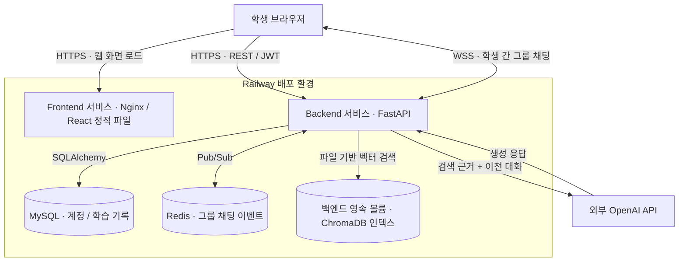
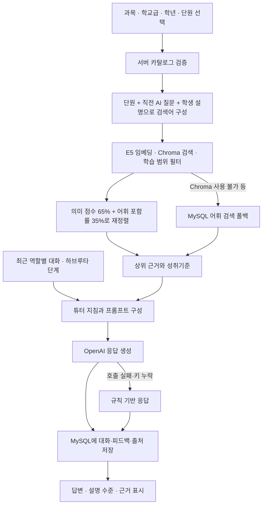
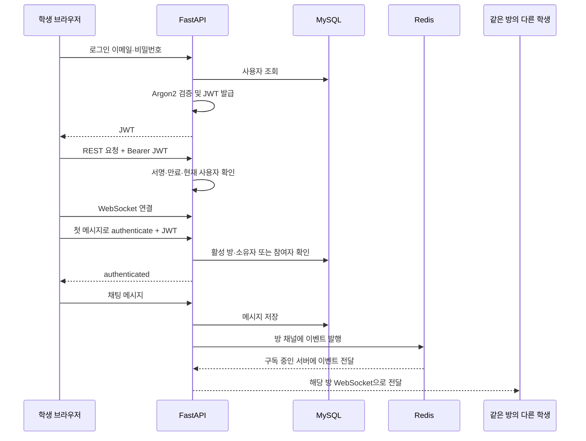
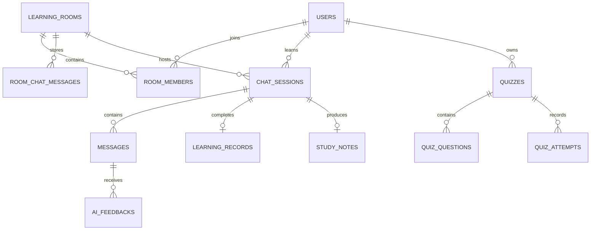
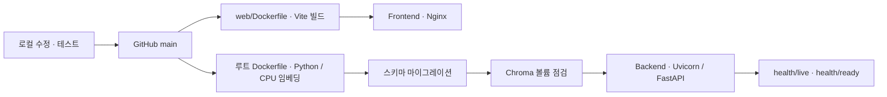

# 하브루타 AI 튜터 — 졸업작품 발표 자료

작성 기준: 2026-09-07 / 현재 소스와 Git 이력, 이전 실행 검증 기록을 기준으로 작성.

이 문서는 기획부터 구현·설계·배포·검증까지 설명하기 위한 발표 원고다. 구성도는 Mermaid 형식이며 Mermaid를 지원하는 Markdown 미리보기에서 볼 수 있다. 상세 운영 방법은 [프로젝트 설명서](PROJECT_MANUAL.md), 파일 탐색은 [구조 안내](PROJECT_STRUCTURE.md)를 참고한다. “그냥 ChatGPT 프롬프트 아니냐”는 질문에 대한 답변과 기능별 기술 설명은 [개념 설명과 기술 방어 자료](PRESENTATION_QA_TECH.md)에 따로 정리했다.

## 1. 프로젝트 소개와 추진 배경

**제목: 질문과 설명을 통한 사고 확장, 교육과정 RAG 기반 하브루타 AI 튜터**

학생이 선택한 교과 단원을 자기 언어로 설명하면 AI가 근거와 후속 질문을 제공하고, 학생은 설명을 보완하면서 학습한다. 학습 후에는 대화와 연계된 정리노트·복습 퀴즈를 확인하며, 스터디룸에서는 다른 학생과 토론할 수 있다.

추진 배경은 다음 세 가지 문제의식이다. 이는 기획의 출발점이며 학생 대상 실험으로 입증한 결과는 아니다.

- 정답을 읽거나 암기하는 것만으로 학생이 개념을 설명할 수 있는지 확인하기 어렵다.
- 혼자 학습하는 학생에게는 질문을 주고받을 상대와 설명을 점검할 기회가 부족할 수 있다.
- 일반적인 AI 대화에서는 질문이 교과 범위를 벗어나거나 답변의 근거를 확인하기 어려울 수 있다.

하브루타의 질문·설명·재질문 방식을 AI 학습 흐름에 적용하고, 선택한 교육과정 단원의 자료를 검색해 대화의 근거로 제공하는 것을 목표로 삼았다. 주 대상은 고등학생이며 현재 화면과 자료에는 중학교 범위도 포함된다.

**발표 문장**

> “저희는 학생이 정답을 확인하는 데서 끝나지 않고, 자신의 생각을 설명하고 다시 질문받는 과정을 만들고자 했습니다. 이를 위해 교육과정 단원에 맞춘 RAG 검색과 하브루타 대화, 학습 기록과 복습 기능을 하나의 웹앱으로 연결했습니다.”

## 2. 목표와 구현 내용

| 목표 | 구현 내용 | 확인할 화면 |
|---|---|---|
| 교과 범위에 맞춘 학습 | 과목·학교급·학년·단원 선택과 서버 검증 | 학습 시작 |
| 근거를 확인할 수 있는 답변 | Chroma 검색, 성취기준·발췌문·검색 방식 표시 | 대화의 근거 펼치기 |
| 질문이 이어지는 학습 | 이전 대화 전달, 단계별 질문, 모름·힌트 요청 처리 | AI 채팅 |
| 학습 결과의 축적 | 대화·피드백·완료 기록 저장, 세션 복원 | 학습·홈·캘린더 |
| 복습 지원 | 세션 기반 정리노트, RAG 자료 기반 퀴즈 | 정리노트·퀴즈 |
| 학생 간 상호작용 | 초대 코드 참여, 그룹 채팅, 두 학생 의견 비교 | 스터디룸 |
| 외부 사용자 시연 | Railway의 웹·API·MySQL·Redis 구성 | 공개 접속 주소 |
| 사용자 데이터 관리 | 소유권을 확인하는 퀴즈·노트·방 삭제 | 각 목록의 삭제 버튼 |

## 3. 처음부터 현재까지의 개발 과정

날짜는 Git 커밋 기록 기준이다. 브랜치 이름 `AITraining`은 자료 처리 코드의 출처를 뜻하며, 자체 언어 모델을 학습시켰다는 의미는 아니다.

| 시기 | 개발 단계 | 주요 결과 |
|---|---|---|
| 7월 13일~20일 | 서버 기초 | 백엔드 구조, 회원 시스템, WebSocket 구현 |
| 7월 28일 | 초기 수학 RAG | 고1 수학 자료를 활용하는 검색기와 튜터 추가 |
| 8월 1일 | MVP 통합 | 분리된 프론트·서버·AI 자료 처리 코드를 통합하고 설명서 작성 |
| 8월 1일~4일 | DB·클라우드 연결 | MySQL 연동, Railway 배포 구성, OpenAI 연결 |
| 8월 10일~11일 | AI 연결 보완 | Chroma와 OpenAI 연계, 과학 학습 및 빈 화면 오류 대응 |
| 8월 23일 | 다과목 RAG 확장 | 2022 성취기준 연계 검색, Chroma 영속 볼륨, CPU용 이미지 구성 |
| 8월 26일 | 교육과정 선택 | 자유 주제 입력에서 과목·학교급·학년·단원 선택 방식으로 개선 |
| 9월 1일 | 브라우저 안정성 | 저장소 접근 오류와 채팅 렌더링 오류 대응 |
| 9월 4일 | 학습 흐름 보완 | 대화 문맥, 학년 필터, 세션 복원, 공동 토론, 설명 루브릭·사용량 제한 |
| 9월 5일 | 구조 정리 | 프론트·백엔드 분리를 거쳐 최종적으로 `app/rag/` 중심 구조로 정리 |
| 9월 6일 | 삭제 기능 | 퀴즈·노트 소유자 삭제, 방장 스터디룸 삭제 및 권한 검증 |
| 9월 7일, 로컬 | 다크모드 가독성 | 제목·본문·보기·해설·알림의 색상 대비와 상태 구분 보완 |

현재 마지막으로 배포 성공을 확인한 커밋은 `d5d4318`이다. 다크모드 추가 개선은 로컬에 있으며 아직 커밋·배포하지 않았다. 문서 작성 중 실시간 배포 상태를 다시 조회한 것은 아니다.

## 4. 전체 시스템 구성도



React는 브라우저에서 실행된다. Nginx는 빌드된 웹 파일을 제공하며, 브라우저는 별도 FastAPI 주소로 API를 호출한다. 개인 AI 대화는 REST 요청·응답 방식이다. 그룹 채팅에 WebSocket을 사용하며 AI 답변을 WebSocket으로 스트리밍하는 구조는 아니다.

MySQL은 사용자와 학습 기록의 영속 저장소다. Redis는 실시간 이벤트 전달에 사용한다. ChromaDB는 별도 관리형 DB 서비스가 아니라 백엔드가 영속 볼륨의 파일을 읽는 형태다. OpenAI 키는 백엔드 환경변수로 관리한다.

**발표 문장**

> “웹 화면, API 서버, 관계형 데이터베이스, 실시간 이벤트 전달 계층으로 역할을 나눴습니다. 학습 기록은 MySQL에 저장하고, 교과 자료 검색에는 ChromaDB를 사용합니다. 검색한 근거와 이전 대화를 OpenAI에 전달해 후속 질문을 생성합니다.”

## 5. 기술 선택과 역할

| 기술 | 프로젝트에서의 역할 | 선택 이유 |
|---|---|---|
| React·JavaScript·CSS | 화면과 입력 상태, API 결과 표시 | 학습·퀴즈·노트 등 화면을 컴포넌트로 관리 |
| Vite | 개발 서버와 정적 파일 빌드 | 프론트 개발·배포 흐름 구성 |
| FastAPI·Python | REST·WebSocket API, 기능 조립 | Python 기반 RAG 코드와 서버를 연결 |
| Pydantic | 요청 형식과 설정 검증 | API 입력 오류를 일관되게 처리 |
| SQLAlchemy·PyMySQL | DB 모델과 MySQL 접근 | 도메인 관계와 저장 로직 관리 |
| MySQL | 계정·학습·노트·퀴즈 저장 | 연관 데이터와 기록의 영속성 |
| PyJWT·Argon2 | 서명 토큰 인증·비밀번호 해싱 | 요청 사용자 확인과 비밀번호 원문 미저장 |
| ChromaDB | 교과 자료 벡터 검색 | 의미가 가까운 자료 검색 |
| Sentence Transformers·multilingual-e5-base | 검색 질의 임베딩 | 기존 인덱스의 768차원 임베딩과 정합성 유지 |
| OpenAI SDK | 근거·대화 문맥을 이용한 응답 생성 | 외부 생성 모델 연결 |
| Redis | 방 단위 Pub/Sub | 여러 서버 인스턴스 사이의 이벤트 전달 구조 지원 |
| Docker·Nginx·Railway | 이미지 빌드·웹 제공·배포 | 다른 사용자가 공개 주소로 접속하는 환경 구성 |

현재 코드에 LangChain·LangGraph는 사용하지 않는다. 검색·생성·단계 관리를 Python 함수와 DB 저장으로 직접 구현했다. 현재 생성형 모델 제공자는 OpenAI이며 Ollama를 실행해야 하는 구조가 아니다.

## 6. 프론트엔드 발표

### 화면과 파일의 대응

경로 기준은 `web/src/`다.

| 파일 | 담당 화면·역할 |
|---|---|
| `main.jsx`, `App.jsx` | React 실행, 인증 상태와 메뉴별 화면 전환 |
| `AuthView.jsx` | 회원가입·로그인·입력 오류 표시 |
| `Home.jsx` | 실제 학습 기록 기반 홈 통계 |
| `CurriculumSelector.jsx` | 과목에 맞는 학교급·학년·단원 선택 |
| `StudyView.jsx` | AI 대화, 피드백·출처 표시, 진행 세션 복원 |
| `StudyRoomView.jsx` | 방 생성·참여, 그룹 채팅, 공동 분석, 방 삭제 |
| `NoteView.jsx` | 정리노트 목록·상세·삭제 |
| `QuizView.jsx` | 퀴즈 생성·응시·채점·삭제 |
| `CalendarView.jsx`, `MyPageView.jsx` | 월별 기록과 개인 학습 통계 |
| `SettingsView.jsx` | 테마 설정과 시스템 준비 상태 |
| `api.js` | REST 요청, JWT 전달, 요청 제한 시간·오류 처리 |
| `clientStorage.js` | 토큰·테마·진행 중 세션 ID 저장 |
| `index.css`, `dark-theme.css` | 공통 색상 및 다크모드 대비 보완; 후자는 로컬 변경 |

### 프론트엔드에서 해결한 문제

1. API 응답을 바탕으로 화면을 갱신하고 임의 통계 대신 실제 기록을 표시했다.
2. 학습 세션 ID를 이용해 서버의 대화와 답변 근거를 다시 불러오도록 했다.
3. 요청 실패 시 오류를 보여주고, 채팅 입력을 복구하도록 했다.
4. 브라우저 저장소 접근 문제와 렌더링 오류에 대한 복구 흐름을 보완했다.
5. 삭제 버튼은 확인창과 처리 중 비활성화를 적용하고, 성공 후 목록·상세 상태를 갱신한다.
6. 다크모드 추가 개선에서는 텍스트와 배경을 함께 지정하고 정답·오답·선택 상태의 색상을 구분했다.

화면에서 버튼을 숨기는 것만으로 권한을 보호하지 않는다. 삭제 권한과 방 접근 권한은 서버에서도 검증한다.

**발표 문장**

> “프론트엔드는 학습 시작부터 대화, 근거 확인, 복습까지 이어지는 흐름을 담당합니다. 화면을 새로고침해도 진행 중인 대화를 복원하고, 오류나 삭제 결과를 사용자가 이해할 수 있도록 표시했습니다.”

## 7. 백엔드 발표와 코드 구조

```text
프로젝트/
├── app/
│   ├── rag/
│   │   ├── retriever.py     자료 인덱싱·벡터/어휘 검색
│   │   ├── tutor.py         프롬프트·이전 대화·생성·설명 평가
│   │   └── curriculum.py    단원 카탈로그와 선택 검증
│   ├── routers/             HTTP·WebSocket 진입점
│   ├── services/            노트·퀴즈·공동 토론·요청 제한
│   ├── models/              SQLAlchemy 테이블 모델
│   ├── schemas/             API 입력 형식
│   ├── database/            환경변수·DB 연결
│   ├── resources/           교육과정 카탈로그 JSON
│   └── utils/security.py    비밀번호 해싱·JWT
├── data/                    수학 샘플 JSON 10건
├── chroma_db/               대용량 로컬 인덱스, Git 제외
├── scripts/                 마이그레이션·검증·카탈로그 생성
├── tests/                   API·RAG·삭제 권한 테스트
├── web/                     React 프로젝트
├── docs/                    공통 문서
└── main.py                  앱 구성·시작·종료 처리
```

라우터는 요청을 받고 인증·입력을 검사한다. RAG 모듈과 서비스가 실제 작업을 수행하고, 모델·DB 계층이 결과를 저장한다. 실제 코드에서는 간단한 조회·저장을 라우터에서 직접 처리하기도 하며 모든 기능이 엄격하게 같은 계층을 통과하는 것은 아니다.

| 기능 | 주요 API | 핵심 처리 |
|---|---|---|
| 인증 | `POST /auth/signup`, `POST /auth/login` | 해싱·검증·JWT 발급 |
| 방 관리 | `GET/POST /rooms`, `POST /rooms/join` | 소유자·참여자·초대 코드 |
| 학습 | `POST /sessions`, `POST /sessions/{id}/messages` | 대화 저장, RAG·생성·평가 |
| 학습 완료 | `POST /sessions/{id}/finish` | 완료 기록·노트 생성 |
| 자료 탐색 | `GET /rag/catalog`, `POST /rag/search` | 카탈로그와 범위 제한 검색 |
| 복습 | `/notes`, `/quizzes`, `/quizzes/{id}/submit` | 콘텐츠 조회·생성·채점 |
| 통계 | `GET /dashboard/me`, `GET /dashboard/calendar` | 실제 기록 집계 |
| 그룹 채팅 | `WS /chat/ws/{room_id}` | 인증·참여 권한·저장·방송 |
| 공동 분석 | `POST /chat/rooms/{room_id}/ai-feedback` | 두 명 이상 의견과 RAG 비교 |
| 삭제 | `DELETE /notes/{note_id}`, `/quizzes/{quiz_id}`, `/rooms/{room_id}` | 소유권 검사·삭제 정책 적용 |

**발표 문장**

> “백엔드는 사용자 권한을 확인하고 학습 세션과 기록을 관리합니다. 특히 RAG 검색과 튜터 응답 코드를 한곳에 모아 자료가 어떻게 검색되고 답변으로 연결되는지 추적하기 쉽게 구성했습니다.”

## 8. RAG 구성도와 하브루타 대화



RAG는 검색한 자료를 생성 모델의 입력에 추가하는 방식이다. 자체 GPT 모델을 학습하거나 파인튜닝한 것은 아니다. 검색용 임베딩과 생성형 모델 호출을 구분해서 설명한다.

### 데이터의 구분

| 위치 | 내용 | 역할 |
|---|---|---|
| `data/` | 고1 수학 JSON 10건 | 개발·테스트용 자료, 시작 시 MySQL 문서·청크로 등록 |
| `chroma_db/` 및 Railway 볼륨 | 확인된 Chroma 문서 302,059건 | 여러 과목의 검색 인덱스 |
| `app/resources/curriculum_catalog.json` | 자료에서 집계한 성취기준·단원 카탈로그 | 선택 UI와 서버 검증 |

검색을 확인한 과목은 국어·영어·수학·사회·사회문화·과학·도덕·기술가정·정보다. 이 수치는 파일·문서 레코드 수이며 교과서 수나 서로 다른 개념 수를 뜻하지 않는다. 2022 원본 자료와 2022 성취기준이 매핑된 자료를 사용한다. 모든 교과목·학년·단원의 완전한 수록을 입증한 것은 아니다.

Chroma가 사용할 수 없을 때 수학 샘플 10건만으로 모든 과목을 대신할 수는 없다. 선택 범위에 해당하는 자료가 없으면 자료 부족 상태로 안내한다.

### AI가 하브루타 방식으로 응답하는 위치

[`app/rag/tutor.py`](../app/rag/tutor.py)의 시스템 지침·프롬프트가 역할을 지정한다. 이전 학생·AI 메시지는 역할을 구분해 최근 최대 10개를 전달한다. 현재 단원, 직전 질문, 학생 답변과 검색 근거를 함께 반영한다.

학습 단계는 `개념 설명 → 근거 확인 → 생각 수정 → 적용 → 최종 정리`다. 현재 구현은 의미 있는 학생 설명 횟수를 기준으로 단계를 계산한다. `몰라`, `힌트` 등은 단계 진행·오답 점수에서 제외하며 같은 개념을 더 쉽게 이어가도록 지시한다. 모델이 항상 의도대로 이어간다는 보장은 없고 대화 품질 검증이 필요하다.

**발표 문장**

> “학생이 선택한 단원의 자료를 먼저 검색하고, 이전 대화와 함께 모델에 전달합니다. 모델에는 정답 전달만으로 끝내지 않고 학생의 생각을 확인하는 질문을 하도록 지침을 줍니다. 모른다는 답변에는 진도를 넘기기보다 힌트를 주도록 처리했습니다.”

## 9. JWT·WebSocket 동작 구성도



JWT에는 사용자 ID와 만료시간을 넣고 서명한다. 기본 만료시간은 설정상 7일이며 환경변수로 조절한다. 토큰은 암호화된 사용자 데이터 저장소가 아니라 요청자의 신원을 검증하기 위한 서명 토큰이다.

그룹 채팅은 연결 후 10초 이내 첫 메시지로 인증하며 URL에 토큰을 넣지 않는다. 빈 메시지와 5,000자 초과 입력을 검사한다. 방 삭제 후에는 기존 연결의 다음 메시지에서도 방 접근을 재검사한다.

Redis Pub/Sub은 여러 백엔드가 같은 이벤트를 전달받을 수 있는 구조를 제공한다. 다중 인스턴스 부하 테스트까지 완료했다는 뜻은 아니다. Redis 시작·발행 실패 시 로컬 전달 경로가 있으나 런타임 장애의 모든 경우를 완전히 복구하는 것은 아니다.

현재 JWT는 브라우저 localStorage에 저장한다. Refresh Token, 서버 토큰 폐기 목록, 로그인 시도 제한 등은 별도 보완 대상이다. 재연결은 구현했지만 모든 메시지의 전달 보장이나 재연결 구간 누락 복구까지 보장하지 않는다.

## 10. 데이터베이스 구성과 삭제 정책

MySQL에는 16개 도메인 테이블이 있다.

| 영역 | 테이블 |
|---|---|
| 사용자·방 | `users`, `learning_rooms`, `room_members`, `room_chat_messages` |
| 개인 학습 | `chat_sessions`, `messages`, `ai_feedbacks`, `ai_usage_events`, `learning_records` |
| RAG 메타데이터 | `documents`, `document_chunks`, `rag_references` |
| 복습 | `study_notes`, `quizzes`, `quiz_questions`, `quiz_attempts` |



위 ERD는 발표용 주요 관계만 표시한 것으로 16개 테이블의 모든 외래키를 표현하지 않는다. Chroma 출처는 메시지의 `response_meta_json`에 보존하며, MySQL 문서 청크를 참조하는 `rag_references`와 구분한다.

| 삭제 대상 | 권한 | 처리 방식 | 유지하는 정보 |
|---|---|---|---|
| 정리노트 | 본인 | 노트 영구 삭제 | 원래 대화·완료 기록 |
| 퀴즈 | 본인 | 퀴즈·문제·응시 기록 함께 삭제 | 다른 퀴즈와 개인 학습 기록 |
| 스터디룸 | 방장 | 상태를 `closed`로 바꾸는 논리 삭제 | 개인 학습·노트와 기존 DB 기록 |

방은 목록에서 숨기고 신규 참여·그룹 채팅·새 학습 시작을 차단한다. 기존 개인 학습 기록을 연쇄 삭제하지 않기 위한 설계다. 종료되지 않은 개인 학습 세션까지 모두 강제로 삭제하는 방식은 아니다.

## 11. 배포 구조와 운영 안정성



서버 Root Directory는 `/`, 웹은 `/web`이다. 백엔드 이미지는 CPU용 PyTorch와 검색 임베딩 모델을 포함한다. 대용량 Chroma 파일과 실제 `.env`는 Git·Docker 이미지에서 제외하고 영속 볼륨·환경변수로 관리한다. 맥을 켜두어야 웹사이트가 작동하는 구조는 아니다.

- 프로세스 상태: `GET /health/live`.
- DB·RAG 등 준비 상태: `GET /health/ready`.
- 기본 AI 호출 제한: 사용자별 분당 12회, 최근 24시간 200회.
- 기본 응답 상한: 700토큰, OpenAI 호출 제한시간 45초.
- 생성 실패 시 규칙 기반 응답, Chroma 사용 불가 시 어휘 검색 경로.

준비 상태의 `provider_configured`는 키 설정 여부다. 실제 OpenAI 호출 성공이나 답변 정확도를 의미하지 않는다. `rag.ready` 역시 인덱스·자료 준비 여부이므로 생성·검색 품질 검증과 구분한다.

## 12. 검증 결과와 정확한 해석

아래는 이전 작업에서 확인한 기록이며 이번 문서 작성 때문에 유료 생성 호출이나 전체 테스트를 다시 실행하지 않았다.

| 검증 | 기록된 결과 | 해석 범위 |
|---|---|---|
| 삭제 기능 반영 후 자동 테스트 | 25개 통과 | API·권한·기록 보존·연관 삭제 등 구현 검증 |
| 프론트 정적 검사·빌드 | lint·Vite build 통과 | 코드 검사와 빌드 가능 여부 |
| RAG 구조 배포 후 실제 스모크 | PASS | 두 사용자 채팅·공동 분석·학습·노트·퀴즈 흐름 |
| 위 스모크의 생성·검색 | OpenAI / Chroma, 근거 3개 | 해당 테스트 요청의 실제 제공자 확인 |
| 위 스모크의 후속 결과 | 노트 8개 섹션, 퀴즈 3문항 | 해당 시나리오 결과 |
| 삭제 기능 배포 후 | 양쪽 SUCCESS, 삭제 API 3개 확인, ready 정상 | 최신 API 배포와 준비 상태; 실사용 자료 삭제 테스트는 아님 |
| 9월 4일 검색 평가 | 9과목·27질의, Hit@3 100% | 성취기준 문장을 질의로 한 제한된 검색 평가 |
| 같은 평가의 시간 | 평균 2,368ms | 당시 로컬 측정값; 운영 응답시간 보장 아님 |
| 9월 7일 다크모드 개선 | 주요 지정 색상 쌍 명암비 확인·빌드 통과 | 로컬 수정; 브라우저 시각 검증은 미실시 |

**발표에서 과장하면 안 되는 부분**

- “AI 답변 정확도 100%”라고 말하지 않는다. Hit@3는 특정 질의에 맞는 자료가 검색 상위에 포함됐는지의 지표다.
- `grounded=true`는 검색 근거가 존재한다는 뜻이다. 답변이 근거와 일치하는지 자동 검증한 결과는 아니다.
- 학생 점수는 개념 키워드 40점, 근거·추론 30점, 명료성 20점, 참여도 10점의 휴리스틱이다. 정답 의미를 이해하는 평가자나 검증된 학업 성취도 점수가 아니다.
- 퀴즈의 정오답은 저장된 정답 인덱스와 비교한다. 생성 문항과 선택지의 교육적 타당성이 모두 검증됐다는 의미는 아니다.
- 학생 학습 효과는 사전·사후 검사나 대조군 실험으로 아직 측정하지 않았다.

## 13. 수행 결과와 남은 보완점

**수행 결과 제목: 교육과정 근거와 대화·복습·협업을 연결한 학습 MVP 구현**

분리되어 있던 화면·API·자료 처리 코드를 통합하고, 단원 RAG를 활용한 AI 학습부터 대화 저장·정리노트·퀴즈·통계까지 연결했다. 학생 간 실시간 채팅과 공동 의견 분석을 추가했으며, 외부 접속 가능한 Railway 환경에서 전체 흐름을 검증했다. 이후 소유권 기반 삭제와 화면 오류 대응·세션 복원·다크모드 가독성을 보완했다.

다음 보완 우선순위는 기능 추가보다 검증 강화다.

1. 교사·학생 질의로 구성한 독립 평가셋을 마련하고 검색 적절성과 응답 사실성을 각각 평가한다.
2. 대화가 주제를 벗어나거나 질문을 반복하는 비율을 측정하고 프롬프트·검색어 구성을 개선한다.
3. 수업·학년별 자료 누락과 메타데이터 품질, 퀴즈 선택지의 타당성을 검수한다.
4. 실제 학생 사용성·학습 효과를 측정한다.
5. 인증 강화, Redis 재연결, 메시지 누락 복구, 백업·부하 테스트를 추가한다.

## 14. 10분 발표 구성안

| 순서 | 내용 | 권장 시간 | 핵심 한 문장 |
|---|---|---|---|
| 1 | 문제와 목표 | 1분 | 학생이 자신의 생각을 설명하고 되묻게 한다. |
| 2 | 개발 과정과 기능 | 1분 | 분리된 구현을 실제 학습 흐름으로 통합했다. |
| 3 | 전체 구성도 | 1분 | React·FastAPI·MySQL·Chroma·OpenAI의 역할이 다르다. |
| 4 | 프론트 구현 | 1분 | 단원 선택, 대화 복원, 근거 표시와 복습을 연결했다. |
| 5 | 백엔드와 RAG 구성도 | 2분 | 학습 범위를 제한한 검색과 이전 대화를 함께 사용한다. |
| 6 | JWT·WebSocket·DB | 1분 | 사용자 권한과 저장·실시간 전달을 분리했다. |
| 7 | 시연 | 2분 | 실제 학습부터 노트·퀴즈까지 이어지는 것을 보여준다. |
| 8 | 검증·한계·마무리 | 1분 | 구현 검증과 교육 효과 검증은 구분한다. |

**프론트 발표자가 맡을 범위:** 6절의 화면 구성, API 연결, 입력·오류·삭제 상태 처리와 시연.

**백엔드 발표자가 맡을 범위:** 4·7~12절의 구성도, RAG·인증·DB·배포·검증. 역할 분담은 실제 팀원의 기여에 맞춰 조정한다.

### 짧은 시연 시나리오

1. 설정에서 DB·RAG·AI·실시간 채팅 준비 상태를 확인한다.
2. 수학 방을 선택하고 고등학교 1학년의 도형의 방정식 등 카탈로그에 있는 단원을 선택한다.
3. AI가 실제로 물어본 질문에 맞춰 학생 설명을 입력한다. 미리 정한 답을 무조건 붙여 넣지 않는다.
4. “잘 모르겠어. 같은 질문을 예시로 설명해줘.”라고 입력해 이어지는 질문을 확인한다.
5. 검색 근거를 펼친 뒤 새로고침해 대화 복원을 보여준다.
6. 학습을 종료하고 생성된 노트와 복습 퀴즈를 확인한다.
7. 시간 여유가 있으면 두 계정으로 방 참여·그룹 채팅·공동 분석을 보여준다.
8. 삭제 시연은 본인이 만든 시연용 항목에만 수행하고 삭제 범위를 설명한다.

실제 모델의 응답은 매번 달라질 수 있다. 운영 키를 지우거나 서비스를 중단해서 장애를 연출하지 말고, 폴백은 격리 테스트 기록으로 설명한다.

### 예상 질문과 답변

**Q. 자체 모델을 학습했나요?**
A. 생성형 모델은 OpenAI API를 사용합니다. 저희가 구현한 부분은 자료 검색, 교육과정 필터, 대화 구성과 학습 서비스 연결입니다.

**Q. 그냥 ChatGPT에 프롬프트만 넣은 것 아닌가요?**
A. OpenAI를 이용한 문장 생성 외에 인증·권한, 자료 검색 범위, 대화 상태와 단계 전환, 학습 결과 저장을 애플리케이션으로 구현했습니다. 개발에도 AI 도움을 받았으므로 코드 줄 수를 팀이 손으로 작성한 양이라고 주장하지 않습니다. 팀원별 설계 결정·검토·테스트 기록을 제시하겠습니다. 최신 답변은 [1주차 피드백 대응](CAPSTONE_WEEK1_RESPONSE.md)을 참고하세요.

**Q. 일반 AI 채팅과 다른 점은 무엇인가요?**
A. 과목·단원 범위의 자료를 검색하고 근거를 표시하며, 학습 세션·설명 피드백·노트·퀴즈로 이어지는 흐름을 구성한 점입니다.

**Q. 왜 LangChain이나 LangGraph를 쓰지 않았나요?**
A. 현재 흐름은 Python 함수로 제어할 수 있어 직접 구현했습니다. 분기와 상태 관리가 복잡해질 때 도입할 수 있지만 필수 조건은 아닙니다.

**Q. 점수가 높으면 답변이 맞다는 뜻인가요?**
A. 현재 점수는 키워드와 설명 형식에 기반한 내부 지표입니다. 의미적 정확성이나 학업 성취도를 보증하지 않습니다.

**Q. 학생에게 실제로 도움이 되나요?**
A. 설명·질문·복습을 지원하도록 설계하고 기능 동작을 검증했습니다. 실제 학습 효과는 학생 실험을 통해 확인해야 합니다.

**Q. 방을 삭제하면 학습 기록도 없어지나요?**
A. 방은 종료 상태로 보관해 목록과 신규 이용을 차단하고, 개인 학습 기록은 유지합니다. 퀴즈 삭제는 그 퀴즈의 응시 기록까지 삭제합니다.

**Q. 최신 다크모드 개선도 운영에 반영됐나요?**
A. 이 문서 작성 시점에는 로컬에서 수정·빌드 확인한 상태이며 아직 배포하지 않았습니다.

## 15. 발표 자료 출처와 접속 주소

- [GitHub 저장소](https://github.com/20211400jiho/havruta-ai-tutor)
- [배포 웹앱](https://frontend-production-8c41.up.railway.app)
- [백엔드 API 명세](https://backend-production-98f3.up.railway.app/docs)
- [프로젝트 전체 설명서](PROJECT_MANUAL.md)
- [RAG 구조 안내](PROJECT_STRUCTURE.md)
- [개념 설명과 기술 방어 자료](PRESENTATION_QA_TECH.md): 프롬프트 비중 실측, 기능별 구현·기술 설명, 재질문 대응.
- [기존 완성도·평가 보고서](CAPSTONE_COMPLETION.md): 9월 4일 시점의 측정 기록 포함.
- [배포 안내](RAILWAY_DEPLOYMENT.md): 과거 스냅샷은 당시 기록이며 최신 배포 상태와 구분.
- 코드 근거: [튜터](../app/rag/tutor.py), [검색](../app/rag/retriever.py), [JWT](../app/utils/security.py), [그룹 채팅](../app/routers/chat.py), [DB 모델](../app/models/), [검증 코드](../tests/).

구성도와 발표 문장은 이 저장소의 구현을 설명한다. 교육적 효과와 일반적인 기술 우월성을 실험으로 입증한 자료는 아니다.
