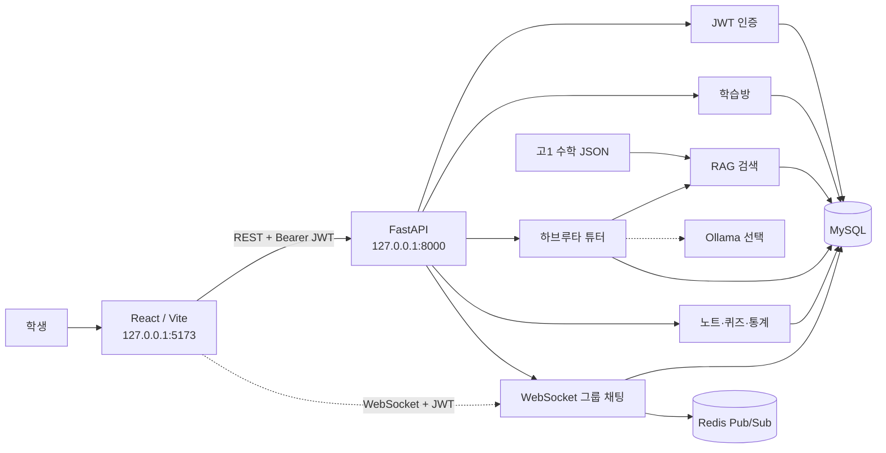
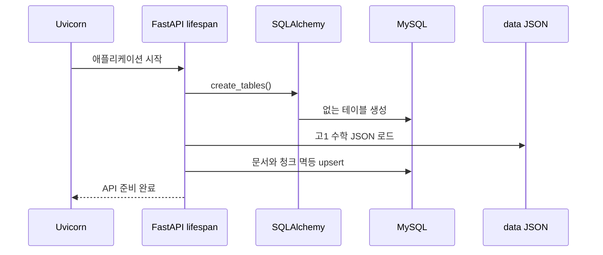
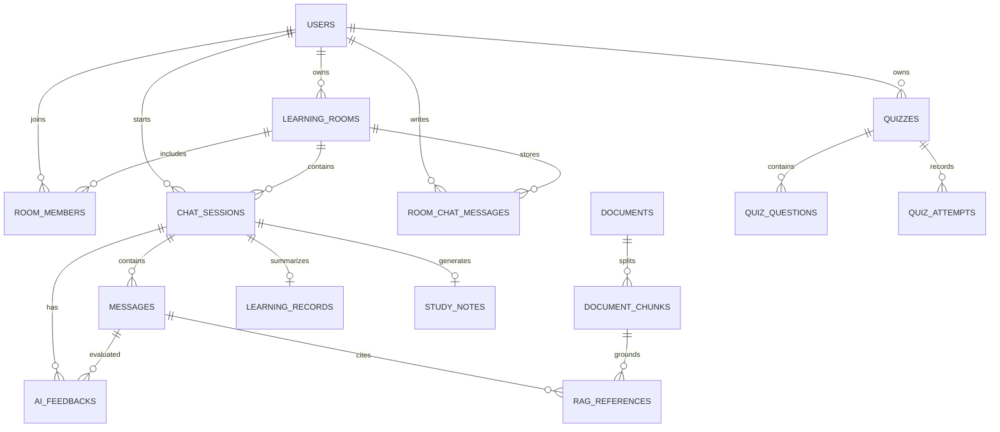
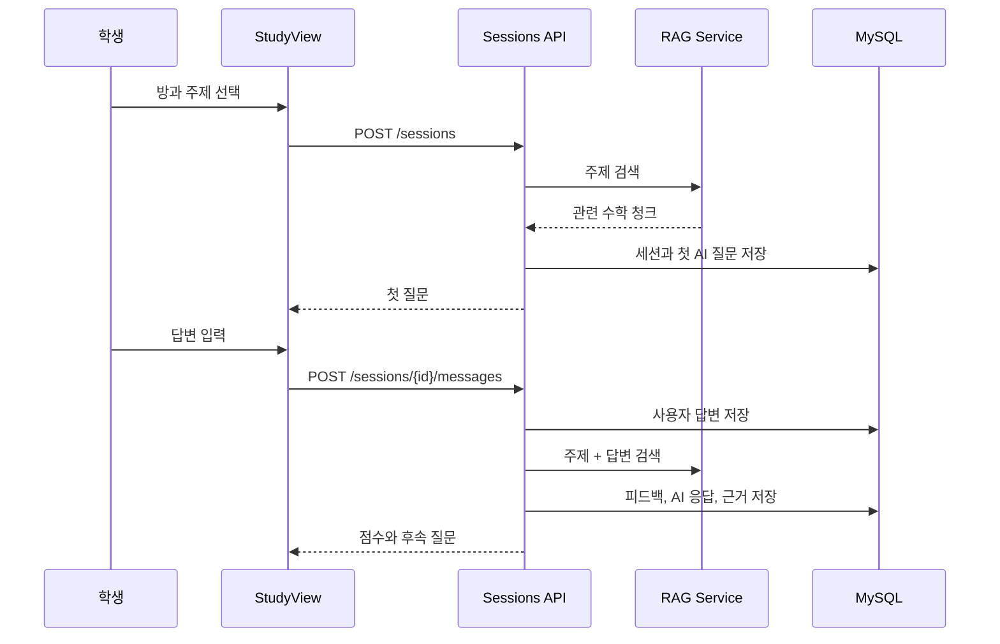

# 하브루타 AI 튜터 종합 설명서

## 1. 문서 목적

이 문서는 하브루타 AI 튜터 프로젝트의 기획 배경, 브랜치 통합 과정, 전체 아키텍처, 데이터베이스, API, 프런트엔드 화면, AI/RAG 동작, 로컬 실행, 테스트, 배포 전 체크사항을 한곳에 정리한 개발·운영 인수인계 문서다.

문서 기준 커밋은 `ae9bcad`이며, GitHub `DB` 브랜치에 백엔드·AITraining·프런트 통합본이 올라가 있다.

## 2. 프로젝트 한눈에 보기

### 2.1 서비스 목적

하브루타는 질문과 설명을 반복하면서 사고를 확장하는 학습 방식이다. 이 프로젝트는 학생이 AI 튜터에게 일방적으로 답을 받는 대신 다음 흐름으로 공부하도록 설계됐다.

1. 학생이 학습 주제를 선택한다.
2. AI가 학습 자료에 근거한 첫 질문을 제시한다.
3. 학생이 자기 언어로 개념이나 풀이를 설명한다.
4. 시스템이 답변을 평가하고 강점과 개선점을 알려준다.
5. AI가 다음 사고를 유도하는 후속 질문을 제시한다.
6. 학습 종료 시 기록과 정리노트를 자동 생성한다.
7. 같은 학습 자료를 사용해 복습 퀴즈를 생성한다.

### 2.2 현재 완성 범위

현재 구현은 로컬에서 처음부터 끝까지 실행 가능한 MVP다.

- React 회원가입·로그인 화면
- Argon2 비밀번호 해싱과 JWT 인증
- 학습방 생성 및 초대 코드 참여
- AI 학습 세션과 메시지 저장
- 고1 수학 RAG 자료 검색
- 학생 답변 평가와 후속 질문
- 세션별 메시지·점수·완료 기록
- 정리노트 자동 생성
- 복습 퀴즈 생성과 채점
- 홈, 캘린더, 마이페이지 통계 연동
- MySQL 스키마와 데이터 인덱싱
- 선택적 Ollama 및 Chroma 실험 도구
- API 자동화 테스트와 실제 MySQL 스모크 테스트

## 3. 브랜치 통합 이력

### 3.1 원래 브랜치

| 브랜치 | 원래 역할 | 주요 내용 |
|---|---|---|
| `main` | 백엔드 | SQLite 회원, 학습방, WebSocket |
| `AITraining` | AI 실험 | `main` + 고1 수학 JSON + Chroma 검색 CLI |
| `front` | 프런트엔드 | React/Vite 화면, CSS, 이미지 자산 |

### 3.2 통합 과정

1. 원격 `AITraining`을 백엔드 기준 브랜치로 가져왔다.
2. 별도 이력이던 `front`를 병합했다.
3. 기존 로컬 MySQL 정규화 모델을 적용했다.
4. SQLite 중복 모델과 `havruta.db`를 제거했다.
5. 프런트의 정적 더미 동작을 실제 API 호출로 변경했다.
6. AITraining JSON을 MySQL 문서·청크 테이블로 인덱싱했다.
7. 인증부터 퀴즈까지 전체 흐름을 검증했다.
8. 최종 통합본을 GitHub `DB` 브랜치에 올렸다.

### 3.3 현재 브랜치

```text
origin/main
origin/AITraining
origin/front
origin/DB          ← 현재 통합 결과

local integration ← 개발 기준
local DB          ← origin/DB 추적
local front       ← 통합 결과를 가리키지만 원격 front에는 미반영
```

주요 커밋:

- `0f46ca6`: 백엔드, AITraining, 프런트 MVP 통합
- `ae9bcad`: 로그인 입력 검증 오류 표시 개선

## 4. 기술 스택

### 4.1 백엔드

| 기술 | 버전 | 역할 |
|---|---:|---|
| Python | 3.13 | 애플리케이션 언어 |
| FastAPI | 0.116.1 | REST 및 WebSocket API |
| Uvicorn | 0.35.0 | ASGI 서버 |
| SQLAlchemy | 2.0.41 | ORM과 DB 세션 |
| PyMySQL | 1.1.1 | MySQL 드라이버 |
| Pydantic Settings | 2.10.1 | 환경변수 설정 |
| PyJWT | 2.10.1 | JWT 발급과 검증 |
| pwdlib + Argon2 | 0.3.0 | 비밀번호 해싱 |
| pytest | 8.4.1 | 자동화 테스트 |

### 4.2 프런트엔드

| 기술 | 역할 |
|---|---|
| React 19 | 화면과 상태 관리 |
| Vite 8 | 개발 서버와 빌드 |
| Fetch API | FastAPI 호출 |
| LocalStorage | JWT 저장 |
| CSS | 각 화면 스타일 |

### 4.3 AI와 데이터

| 구성 | 역할 |
|---|---|
| 고1 수학 JSON 10건 | 기본 RAG 학습 자료 |
| 로컬 어휘 검색 | 기본 경량 검색 엔진 |
| 규칙 기반 평가 | 모델 없이 동작하는 기본 피드백 |
| Ollama | 선택적 로컬 생성형 모델 |
| ChromaDB | 선택적 벡터 검색 실험 |
| multilingual-e5-base | 선택적 다국어 임베딩 모델 |

## 5. 전체 아키텍처



### 5.1 애플리케이션 시작 흐름



## 6. 폴더 구조

```text
.
├── main.py                       # FastAPI 조립, lifespan, CORS
├── requirements.txt              # 기본 백엔드 의존성
├── requirements-ai.txt           # 선택적 Chroma/임베딩 의존성
├── .env.example                  # 환경변수 예시
├── README.md                     # 빠른 시작 문서
├── app/
│   ├── database/
│   │   ├── base.py               # SQLAlchemy Base
│   │   ├── config.py             # 환경변수 설정
│   │   └── connection.py         # 엔진과 세션
│   ├── models/                   # 15개 테이블 ORM
│   ├── routers/                  # HTTP/WebSocket 엔드포인트
│   ├── schemas/                  # 요청/응답 검증
│   ├── services/                 # RAG, 튜터, 콘텐츠 생성
│   ├── dependencies.py           # 현재 사용자 인증 의존성
│   └── utils/security.py         # Argon2와 JWT
├── data/                          # AITraining 수학 JSON 10건
├── my-app/                        # 기존 front React 프로젝트
│   └── src/
│       ├── api.js                 # 공통 API 클라이언트
│       ├── AuthView.jsx           # 로그인/회원가입
│       ├── StudyView.jsx          # AI 학습
│       ├── StudyRoomView.jsx      # 학습방·실시간 채팅
│       ├── NoteView.jsx           # 정리노트
│       ├── QuizView.jsx           # 복습 퀴즈
│       ├── CalendarView.jsx       # 학습 캘린더
│       └── MyPageView.jsx         # 사용자 통계
├── scripts/
│   ├── migrate_schema.py          # 기존 MySQL 스키마 보완
│   └── smoke_test.py              # 실제 서버/MySQL 검증
├── src/                            # AITraining CLI 실험 도구
└── tests/                          # 격리 API 테스트
```

## 7. 데이터베이스 설계

현재 MySQL에는 15개 도메인 테이블이 사용된다.



### 7.1 계정과 학습방

| 테이블 | 핵심 컬럼 | 설명 |
|---|---|---|
| `users` | email, password_hash, name, grade, role | 사용자 계정 |
| `learning_rooms` | title, subject, grade, owner_id, invite_code, max_members | 학습 공간 |
| `room_members` | room_id, user_id, joined_at | 학습방 참여자 |
| `room_chat_messages` | room_id, user_id, content, created_at | 실시간 그룹 채팅 이력 |

`room_members`에는 `(room_id, user_id)` 유니크 제약이 있어 같은 사용자가 중복 참여할 수 없다. 초대 코드는 대문자와 숫자로 구성된 6자리 값이다.

### 7.2 AI 학습

| 테이블 | 핵심 컬럼 | 설명 |
|---|---|---|
| `chat_sessions` | room_id, user_id, topic, state | 한 번의 학습 세션 |
| `messages` | session_id, sender_type, content | 사용자·AI·시스템 메시지 |
| `ai_feedbacks` | score, strengths, improvements, followup_question | 답변 평가 |
| `learning_records` | total_messages, ai_score_avg, completed_at | 완료 세션 요약 |

평가 점수는 0~100 범위 체크 제약을 사용한다. `learning_records.session_id`는 유니크이므로 한 세션에 완료 기록이 하나만 생성된다.

### 7.3 RAG 자료

| 테이블 | 핵심 컬럼 | 설명 |
|---|---|---|
| `documents` | title, subject, grade, file_path | 원본 문서 메타데이터 |
| `document_chunks` | content, chunk_index, metadata_json | 검색 단위 |
| `rag_references` | message_id, chunk_id, relevance_score | AI 메시지 근거 |

JSON 파일명은 `documents.file_path`로 유일하게 관리한다. 앱이 재시작돼도 같은 파일이나 청크가 중복 생성되지 않는다.

### 7.4 노트와 퀴즈

| 테이블 | 핵심 컬럼 | 설명 |
|---|---|---|
| `study_notes` | session_id, title, content | 세션 종료 시 자동 노트 |
| `quizzes` | user_id, title, subject | 생성된 퀴즈 |
| `quiz_questions` | question, options, correct_index | 객관식 문제 |
| `quiz_attempts` | answers, score, submitted_at | 사용자 제출 결과 |

## 8. 사용자 기능 설명

### 8.1 회원가입과 로그인

회원가입 필드:

- 이메일
- 8자 이상 비밀번호
- 이름
- 학년
- 역할: 기본 `student`, 선택적으로 `teacher`

처리 순서:

1. 프런트가 이메일의 공백을 제거하고 소문자로 변환한다.
2. FastAPI가 이메일 형식과 필드 길이를 검증한다.
3. 비밀번호를 Argon2로 해싱한다.
4. 사용자 레코드를 생성한다.
5. `sub`에 사용자 ID가 들어간 JWT를 발급한다.
6. 프런트가 JWT를 `localStorage`에 저장한다.
7. 이후 요청은 `Authorization: Bearer <token>`을 사용한다.

로그인 실패 메시지:

- 입력 검증 실패: 문제가 있는 필드와 원인 표시
- 잘못된 계정 정보: 이메일 또는 비밀번호가 올바르지 않음
- 중복 회원가입: 이미 가입된 이메일

### 8.2 학습방

사용자는 학습방을 만들거나 초대 코드로 참여한다.

- 제목, 과목, 학년, 최대 인원 설정
- 6자리 초대 코드 자동 생성
- 방장은 자동으로 멤버에 포함
- 종료된 방 또는 정원이 찬 방 참여 차단
- 본인이 소유하거나 참여한 방만 목록에 표시

### 8.3 AI 학습 세션



### 8.4 학습 종료

학습 종료 시 시스템은 다음을 한 번에 처리한다.

1. 메시지 수 계산
2. AI 피드백 평균 점수 계산
3. 세션 상태를 `finished`로 변경
4. `learning_records` 생성
5. 사용자가 설명한 내용과 후속 질문으로 정리노트 생성

같은 세션을 다시 종료해도 중복 기록을 생성하지 않는다.

### 8.5 정리노트

정리노트에는 다음 내용이 들어간다.

- 학습 주제
- 사용자가 직접 작성한 답변 목록
- AI 평가 평균
- 전체 메시지 수
- 다시 생각할 후속 질문 최대 3개

프런트의 정리노트 화면에서 목록과 상세 내용을 확인할 수 있다.

### 8.6 복습 퀴즈

1. 사용자가 퀴즈 주제를 입력한다.
2. RAG에서 관련 질문·정답을 찾는다.
3. 다른 정답과 기본 오답을 섞어 객관식 선택지를 만든다.
4. 사용자가 모든 답을 제출한다.
5. 서버에서 정답을 비교해 100점 기준 점수를 계산한다.
6. 문제별 정답, 오답 여부, 해설을 반환한다.
7. 시도 기록과 최고 점수를 저장한다.

## 9. AI와 RAG 상세 동작

### 9.1 기본 로컬 모드

기본 설정은 다음과 같다.

```env
AI_PROVIDER=local
```

이 모드는 GPU, 모델 다운로드, 외부 API 키가 필요 없다.

#### 검색

1. 질문에서 한글 단어, 영문, 숫자, 분수, 좌표를 추출한다.
2. 불필요한 일반 단어를 제거한다.
3. 문서 청크 토큰과 겹치는 항목을 계산한다.
4. 정확히 포함된 표현에 추가 점수를 준다.
5. 상위 `top_k` 청크를 반환한다.

#### 답변 평가

현재 점수는 교육용 평가 모델이 아니라 MVP용 휴리스틱이다.

- 기본 점수: 50
- 답변 길이 가산점
- 기대 정답 핵심어 중복 가산점
- 최대 점수: 95

답변이 짧으면 근거나 풀이 과정을 더 쓰도록 안내한다. 핵심어가 부족하면 조건과 결론의 연결을 다시 확인하게 한다.

### 9.2 Ollama 모드

`.env`를 다음처럼 설정하면 로컬 Ollama를 호출한다.

```env
AI_PROVIDER=ollama
OLLAMA_BASE_URL=http://127.0.0.1:11434
OLLAMA_MODEL=qwen2.5:3b
```

Ollama에는 학습 주제, 학생 답변, RAG 참고 자료가 함께 전달된다. 30초 내에 응답하지 않거나 연결에 실패하면 기본 로컬 응답으로 자동 전환된다.

### 9.3 Chroma 임베딩 실험

Chroma와 다국어 E5 모델은 기본 앱 실행에 포함되지 않는다.

```bash
pip install -r requirements-ai.txt
python -m src.index_math_chroma
python -m src.query_math_chroma
```

최초 실행 시 Hugging Face 모델 다운로드가 필요하며 수백 MB 이상의 저장 공간을 사용할 수 있다.

## 10. API 설명

모든 인증 API는 회원가입과 로그인 외에 Bearer JWT가 필요하다.

### 10.1 상태와 인증

| 메서드 | 경로 | 설명 | 인증 |
|---|---|---|---|
| GET | `/` | 서버 상태 | 불필요 |
| POST | `/auth/signup` | 회원가입과 토큰 발급 | 불필요 |
| POST | `/auth/login` | 로그인과 토큰 발급 | 불필요 |
| GET | `/auth/me` | 현재 사용자 | 필요 |

회원가입 요청 예시:

```json
{
  "email": "student@example.com",
  "password": "strong-password",
  "name": "하브루타 학생",
  "grade": "고등학교 1학년",
  "role": "student"
}
```

### 10.2 학습방

| 메서드 | 경로 | 설명 |
|---|---|---|
| GET | `/rooms` | 내 학습방 목록 |
| POST | `/rooms` | 학습방 생성 |
| POST | `/rooms/join` | 초대 코드 참여 |
| GET | `/rooms/{room_id}` | 학습방과 멤버 상세 |

### 10.3 AI 학습 세션

| 메서드 | 경로 | 설명 |
|---|---|---|
| GET | `/sessions` | 내 세션 목록 |
| POST | `/sessions` | 세션 시작과 첫 질문 생성 |
| GET | `/sessions/{session_id}` | 세션과 메시지 조회 |
| POST | `/sessions/{session_id}/messages` | 사용자 답변과 AI 피드백 |
| POST | `/sessions/{session_id}/finish` | 세션 종료, 기록과 노트 생성 |

메시지 응답에는 AI 메시지와 평가 객체가 함께 들어간다.

```json
{
  "message": {
    "sender_type": "ai",
    "content": "좋아요... 다음 질문: ..."
  },
  "feedback": {
    "score": 73,
    "summary": "...",
    "strengths": "...",
    "improvements": "...",
    "followup_question": "..."
  }
}
```

### 10.4 RAG

| 메서드 | 경로 | 설명 |
|---|---|---|
| POST | `/rag/index` | 로컬 JSON 수동 재인덱싱 |
| POST | `/rag/search` | 관련 수학 청크 검색 |

### 10.5 노트, 퀴즈, 통계

| 메서드 | 경로 | 설명 |
|---|---|---|
| GET | `/notes` | 내 노트 목록 |
| GET | `/notes/{note_id}` | 노트 상세 |
| GET | `/quizzes` | 내 퀴즈 목록 |
| POST | `/quizzes` | RAG 기반 퀴즈 생성 |
| GET | `/quizzes/{quiz_id}` | 퀴즈 문제 조회 |
| POST | `/quizzes/{quiz_id}/submit` | 답안 제출과 채점 |
| GET | `/dashboard/me` | 내 학습 통계 |

### 10.6 WebSocket

```text
ws://127.0.0.1:8000/chat/ws/{room_id}
```

연결 직후 `{ "type": "authenticate", "token": "JWT" }`를 보내면 JWT와 활성 학습방의 소유자·멤버 권한을 확인한다. 토큰을 URL에 넣지 않으므로 일반 접근 로그에 노출되지 않는다. 이후 `{ "content": "메시지" }` 형식으로 전송한 메시지는 MySQL에 저장되고 같은 방 사용자에게 구조화된 이벤트로 전달된다. 과거 메시지는 `GET /chat/rooms/{room_id}/messages`로 복원한다. Redis가 설정되면 여러 백엔드 인스턴스 사이에서도 이벤트가 전달된다.

## 11. 프런트엔드 화면

### 11.1 인증 화면

- 로그인/회원가입 모드 전환
- 이메일 소문자 및 공백 정규화
- 8자 비밀번호 검사
- FastAPI `422` 상세 오류를 필드별로 표시
- 성공 시 JWT와 사용자 정보 저장

### 11.2 홈

- 사용자 이름 표시
- 완료 세션 수
- AI 평가 평균
- 누적 메시지 수
- 최근 학습 기록
- 학습·퀴즈·노트·캘린더 바로가기

### 11.3 학습하기

- 학습방 선택
- 학습 주제 입력
- 첫 AI 질문 표시
- 사용자/AI 말풍선
- 답변 전송 중 상태
- 최근 평가 점수와 강점
- 학습 종료

### 11.4 스터디룸

- 내 학습방 목록
- 학습방 생성
- 초대 코드 참여
- 코드 클립보드 복사
- 인원 현황 표시

### 11.5 퀴즈

- 주제 기반 새 퀴즈 생성
- 기존 퀴즈 목록과 최고 점수
- 객관식 답안 선택
- 서버 채점
- 문제별 정답 및 해설 표시

### 11.6 정리노트

- 자동 생성된 노트 목록
- 노트 제목과 과목
- 상세 노트 내용

### 11.7 캘린더와 마이페이지

- 완료 기록을 날짜별로 표시
- 학습 주제, 메시지 수, 평균 점수
- 누적 완료 세션과 총 메시지
- 사용자 이메일, 학년, 역할

### 11.8 설정

- 다크 모드 토글
- 알림 설정 토글
- 현재 설정 값은 프런트 상태이며 서버에는 저장하지 않는다.

## 12. 환경 구축과 실행

### 12.1 준비물

- macOS 또는 Python/MySQL/Node.js가 실행 가능한 환경
- Python 3.11 이상 권장
- Node.js와 npm
- MySQL 8 이상

### 12.2 MySQL 시작

Homebrew 설치 환경:

```bash
brew services start mysql
```

최초 DB 생성:

```sql
CREATE DATABASE havruta_ai_tutor
  CHARACTER SET utf8mb4
  COLLATE utf8mb4_unicode_ci;

CREATE USER 'havruta_app'@'localhost'
  IDENTIFIED BY '안전한_비밀번호';

GRANT ALL PRIVILEGES ON havruta_ai_tutor.*
  TO 'havruta_app'@'localhost';
```

### 12.3 백엔드 설치

```bash
python3 -m venv .venv
source .venv/bin/activate
pip install -r requirements.txt
cp .env.example .env
```

`.env`에 실제 DB 비밀번호와 JWT 비밀키를 입력한다.

### 12.4 기존 DB 마이그레이션

```bash
python -m scripts.migrate_schema
```

이 스크립트는 기존 데이터를 삭제하지 않고 다음 컬럼과 유니크 제약을 필요한 경우에만 추가한다.

- `users.grade`
- `learning_rooms.invite_code`
- `learning_rooms.max_members`
- 방 멤버 중복 방지
- 세션 완료 기록 중복 방지
- 문서와 청크 중복 방지

### 12.5 백엔드 실행

```bash
uvicorn main:app --reload --reload-dir app
```

주소:

- 상태: <http://127.0.0.1:8000>
- Swagger: <http://127.0.0.1:8000/docs>

`--reload-dir app`을 사용하는 이유는 `.venv`와 `node_modules` 변경까지 감지해 서버가 반복 재시작되는 것을 방지하기 위해서다.

### 12.6 프런트 실행

```bash
cd my-app
npm install
npm run dev -- --host 127.0.0.1
```

접속: <http://127.0.0.1:5173>

다른 API 주소를 사용하려면 Vite 환경변수를 설정한다.

```env
VITE_API_URL=http://127.0.0.1:8000
```

## 13. 환경변수 전체 설명

| 환경변수 | 설명 | 개발 기본값/예시 |
|---|---|---|
| `APP_NAME` | API 이름 | Havruta AI Tutor API |
| `APP_ENV` | 실행 환경 | development |
| `DB_HOST` | DB 주소 | 127.0.0.1 |
| `DB_PORT` | DB 포트 | 3306 |
| `DB_USER` | DB 사용자 | havruta_app |
| `DB_PASSWORD` | DB 비밀번호 | 필수 |
| `DB_NAME` | DB 이름 | havruta_ai_tutor |
| `JWT_SECRET_KEY` | JWT 서명키 | 운영 시 반드시 변경 |
| `JWT_ALGORITHM` | JWT 알고리즘 | HS256 |
| `ACCESS_TOKEN_EXPIRE_MINUTES` | 토큰 만료 | 10080분 |
| `CORS_ORIGINS` | 허용 프런트 주소 | localhost:5173 등 |
| `AI_PROVIDER` | AI 방식 | local 또는 ollama |
| `OLLAMA_BASE_URL` | Ollama 주소 | 127.0.0.1:11434 |
| `OLLAMA_MODEL` | Ollama 모델 | qwen2.5:3b |

실제 `.env`는 `.gitignore`에 포함되어 GitHub에 올라가지 않는다.

## 14. 테스트와 검증

### 14.1 백엔드 테스트

```bash
pytest -q
```

현재 4개 테스트가 다음을 검증한다.

1. 상태 API
2. 회원가입 → 방 생성 → 세션 → 답변 → 종료 → 노트 → 통계
3. RAG 검색 결과
4. 퀴즈 생성과 제출

테스트는 `StaticPool` 기반 인메모리 SQLite를 사용해 로컬 MySQL 데이터를 건드리지 않는다.

### 14.2 프런트 검증

```bash
cd my-app
npm run lint
npm run build
```

- ESLint 오류가 없어야 한다.
- `dist` 프로덕션 빌드가 생성돼야 한다.

### 14.3 실제 MySQL 스모크 테스트

백엔드 서버가 실행된 상태에서:

```bash
python -m scripts.smoke_test
```

이 테스트는 실제로 다음 데이터를 생성한다.

- 임시 사용자
- 학습방
- 학습 세션
- 사용자 답변과 AI 피드백
- 완료 기록과 정리노트
- 퀴즈와 퀴즈 시도

따라서 운영 DB가 아닌 개발 DB에서만 실행해야 한다.

## 15. 로그인 문제 해결

### 15.1 `422 Unprocessable Content`

입력값이 API 스키마와 맞지 않는 경우다.

- 이메일 형식 확인
- 비밀번호가 8자 이상인지 확인
- 회원가입 시 이름이 비어 있지 않은지 확인
- 프런트 화면에 표시되는 필드별 오류 확인

### 15.2 `401` 로그인 실패

- 가입한 이메일인지 확인
- 이메일 앞뒤 공백 확인
- 비밀번호 확인

프런트는 이메일 공백 제거와 소문자 변환을 자동 수행한다.

### 15.3 백엔드 연결 실패

```bash
curl http://127.0.0.1:8000/
```

정상 응답:

```json
{"status":"ok","service":"havruta-ai-tutor","docs":"/docs"}
```

### 15.4 MySQL 연결 실패

```bash
brew services list
brew services start mysql
```

`.env`의 호스트, 사용자, 비밀번호, DB 이름을 확인한다.

### 15.5 CORS 오류

프런트 주소가 `.env`의 `CORS_ORIGINS`에 포함돼야 한다. 여러 주소는 쉼표로 구분한다.

## 16. 보안 설계

현재 적용됨:

- Argon2 비밀번호 해싱
- JWT 서명과 만료 검사
- Bearer 인증
- 사용자별 리소스 접근 확인
- 학습방 멤버 권한 확인
- WebSocket JWT·학습방 권한 확인
- 그룹 채팅 입력 길이 제한과 MySQL 영속화
- 환경변수 비밀값 분리
- CORS 허용 주소 제한
- 점수와 유니크 DB 제약

운영 전에 추가할 것:

- 강한 JWT 비밀키와 정기 교체
- MySQL root 비밀번호 설정
- HTTPS
- Refresh Token과 로그아웃 토큰 폐기
- 로그인 횟수 제한
- 입력 길이와 업로드 파일 보안
- 감사 로그와 접근 기록
- 개인정보 보존 및 삭제 정책
- DB 백업과 복구 훈련

## 17. 현재 한계

### 17.1 AI 평가

기본 점수는 규칙 기반이므로 실제 교육적 성취도를 보장하지 않는다. 별도의 전문가 평가셋과 루브릭 검증이 필요하다.

### 17.2 데이터 규모

AITraining 자료는 고1 수학 JSON 10건으로 제한돼 있다. 다른 단원과 과목을 다루려면 자료 추가와 검색 평가가 필요하다.

### 17.3 벡터 검색

기본 API는 어휘 검색을 사용한다. 의미 기반 검색이 필요한 경우 Chroma 또는 다른 벡터 DB를 운영 구조로 통합해야 한다.

### 17.4 WebSocket

JWT 인증, 학습방 멤버 검사, 메시지 DB 저장, 브라우저 재접속, Redis 기반 다중 인스턴스 브로드캐스트를 구현했다. 아직 읽음 상태, 신고, 운영자 감사 화면은 제공하지 않는다.

### 17.5 DB 마이그레이션

현재는 `create_all()`과 소규모 멱등 스크립트를 사용한다. 여러 개발자와 운영 환경에서는 Alembic 리비전 체계가 필요하다.

### 17.6 프런트 설정

다크 모드와 알림 값은 브라우저 상태에만 있으며 사용자 DB에 저장되지 않는다.

## 18. 다음 개발 우선순위

### 1순위 — 운영 기반

- Alembic 도입
- 개발/테스트/운영 환경 분리
- Docker Compose 구성
- CI에서 pytest, lint, build 자동 실행

### 2순위 — AI 품질

- 교육 루브릭 기반 평가 스키마
- RAG 정답률 평가셋
- 더 많은 교과 데이터
- Ollama 또는 외부 LLM 제공자 추상화
- 프롬프트 인젝션 방어

### 3순위 — 실시간 협업

- 읽음 상태와 미확인 메시지 표시
- 메시지 신고와 운영자 감사 화면
- 교사 세션 관찰과 개입

### 4순위 — 사용자 경험

- 노트 편집과 삭제
- 퀴즈 난이도 선택
- 학습 목표와 실제 시간 측정
- 모바일 반응형 개선
- 설정 서버 저장

### 5순위 — 배포 운영 고도화

- Railway 사용자 계정에서 최초 서비스 생성
- 커스텀 도메인 연결
- 모니터링, 알림, 백업

## 19. Git 작업 방법

현재 통합 코드를 받으려면:

```bash
git fetch origin
git switch DB
```

기능 개발 권장 흐름:

```bash
git switch DB
git pull --ff-only origin DB
git switch -c feature/기능명
```

검증 후 Pull Request를 통해 `DB` 또는 최종 통합 대상 브랜치로 병합한다.

실제 `.env`, 가상환경, `node_modules`, 빌드 결과, MySQL 데이터 파일은 커밋하지 않는다.

## 20. 최종 상태 요약

| 항목 | 상태 |
|---|---|
| GitHub DB 브랜치 | 업로드 완료 |
| 기존 front 기반 UI | 통합 완료 |
| MySQL 데이터 모델 | 구현 완료 |
| 회원가입/로그인 | 구현·검증 완료 |
| 학습방 | 구현·검증 완료 |
| AI 학습 세션 | 구현·검증 완료 |
| 로컬 RAG | 구현·검증 완료 |
| Ollama | 선택적 연동 구현 |
| 정리노트 | 구현·검증 완료 |
| 퀴즈 | 구현·검증 완료 |
| 통계·캘린더 | 구현 완료 |
| 실시간 그룹 채팅 | 인증·저장·Redis 연동 완료 |
| Railway 배포 구성 | Docker·환경변수·상태 확인 구성 완료 |
| 자동화 테스트 | 5개 통과 |
| 프런트 린트/빌드 | 통과 |
| Railway 실제 배포 | Hobby 네 서비스 배포·외부 검증 완료 |

현재 프로젝트는 **Railway에 실제 배포된 통합 MVP 단계**다. 공개 Frontend에서 여러 사용자가 가입하고 초대 코드 기반 학습방과 실시간 채팅을 테스트할 수 있다. 실제 사용자 대상 운영 서비스로 전환하려면 보안, 정식 마이그레이션, 백업, 모니터링과 AI 평가 검증을 계속 수행해야 한다. 구체적인 주소와 운영 순서는 `docs/RAILWAY_DEPLOYMENT.md`에 있다.
