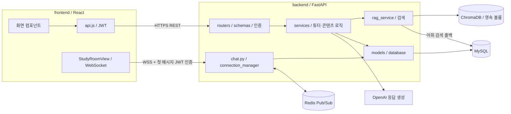

# 프론트엔드·백엔드 프로젝트 구조

2026-09-05 폴더 분리 기준. 하나의 저장소 안에서 화면과 서버를 독립적으로 실행·빌드하는 구조다.

## 왼쪽 파일 트리 읽는 순서

```text
havruta-ai-tutor/
├── frontend/                       # 사용자에게 보이는 웹 화면
│   ├── src/
│   │   ├── main.jsx                # React 실행
│   │   ├── App.jsx                 # 로그인 상태와 화면 전환
│   │   ├── Home.jsx                # 홈 통계
│   │   ├── AuthView.jsx            # 회원가입·로그인
│   │   ├── StudyView.jsx           # AI 학습·대화 복원·근거 표시
│   │   ├── StudyRoomView.jsx       # 학습방·실시간 그룹 채팅
│   │   ├── NoteView.jsx            # 정리노트
│   │   ├── QuizView.jsx            # 퀴즈
│   │   ├── CalendarView.jsx        # 학습 캘린더
│   │   ├── MyPageView.jsx          # 내 학습 통계
│   │   ├── SettingsView.jsx        # 설정
│   │   ├── Sidebar.jsx            # 왼쪽 메뉴
│   │   ├── CurriculumSelector.jsx # 학교급·학년·단원 선택
│   │   ├── api.js                 # HTTP 요청·JWT·WebSocket URL
│   │   ├── clientStorage.js       # 토큰·테마·활성 세션 저장
│   │   ├── *.css                  # 공통 및 화면별 스타일
│   │   └── assets/                # 이미지
│   ├── public/                    # 정적 파일
│   ├── package.json               # JS 의존성과 실행 명령
│   ├── .env.example               # 공개 API 주소 예시
│   ├── Dockerfile                 # React 빌드 → Nginx 제공
│   ├── nginx.conf.template        # HTTP 포트·SPA 라우팅
│   └── railway.json               # 프론트 배포 설정
├── backend/                        # API와 학습 처리
│   ├── main.py                    # FastAPI 실행·앱 수명주기
│   ├── app/
│   │   ├── routers/               # 요청 진입점
│   │   ├── schemas/               # 입력·출력 데이터 형식
│   │   ├── dependencies.py        # JWT 사용자 확인·DB 주입
│   │   ├── services/              # 실제 기능 처리
│   │   ├── models/                # DB 테이블 모델
│   │   ├── database/              # 설정·연결·세션
│   │   ├── resources/             # 교육과정 카탈로그
│   │   ├── utils/security.py      # 비밀번호 해싱·JWT
│   │   └── paths.py               # 공통 경로 기준
│   ├── data/                      # Git에 포함된 RAG 샘플 10건
│   ├── scripts/                   # 마이그레이션·데이터 점검·평가
│   ├── tests/                     # API·튜터 자동 테스트
│   ├── .env.example               # DB·JWT·OpenAI·RAG 설정 예시
│   ├── requirements*.txt          # 기본·AI·개발 의존성
│   ├── pytest.ini                 # 백엔드 테스트 설정
│   ├── Dockerfile                 # Python·임베딩 모델 이미지
│   └── railway.json               # 백엔드 배포 설정
├── docs/                           # 공통 문서
├── chroma_db/                      # 기존 로컬 인덱스, Git 제외
├── .venv/                          # 기존 Python 환경, Git 제외
├── .gitignore                      # 공통 제외 규칙
└── README.md                       # 시작 안내
```

`frontend/node_modules/`, `frontend/dist/`, Python 캐시는 설치·실행 시 생성되는 파일이다. 소스 탐색과 아키텍처 설명에서는 생략해도 된다. 기존 가상환경의 실행 경로를 유지하기 위해 `.venv/`는 루트에 두었다.

## 실제 요청 아키텍처



AI 개인 대화는 REST로 요청하고, 학생 간 그룹 채팅은 WebSocket으로 전달한다. Redis는 채팅 이벤트를 전달하며 메시지 기록은 MySQL에 저장한다.

## 기능별로 찾아갈 파일

아래 경로는 각각 `frontend/src/`, `backend/app/` 기준이다.

| 기능 | 프론트엔드 | 백엔드 |
|---|---|---|
| 로그인 | `AuthView.jsx`, `api.js` | `routers/auth.py`, `utils/security.py` |
| 단원 선택 | `CurriculumSelector.jsx` | `routers/rag.py`, `services/curriculum_catalog.py` |
| AI 하브루타 | `StudyView.jsx` | `routers/sessions.py`, `services/tutor_service.py` |
| RAG | `StudyView.jsx`의 근거 표시 | `services/rag_service.py`, `resources/curriculum_catalog.json` |
| 그룹 채팅 | `StudyRoomView.jsx` | `routers/chat.py`, `services/connection_manager.py` |
| 정리노트·퀴즈 | `NoteView.jsx`, `QuizView.jsx` | `routers/notes.py`, `routers/quizzes.py`, `services/content_service.py` |
| 통계·캘린더 | `Home.jsx`, `MyPageView.jsx`, `CalendarView.jsx` | `routers/dashboard.py` |

## 이동 전후와 실행

| 기존 위치 | 새 위치 |
|---|---|
| `my-app/` | `frontend/` |
| `app/`, `main.py` | `backend/app/`, `backend/main.py` |
| `data/`, `scripts/`, `tests/` | `backend/` 아래의 동일한 폴더 |
| 루트 `.env`, `.env.example`, `requirements*.txt`, `pytest.ini` | `backend/` 아래 |
| 루트 `Dockerfile`, `.dockerignore`, `railway.json` | `backend/` 아래 |
| `docs/`, `chroma_db/`, `.venv/` | 기존 위치 유지 |

백엔드는 루트에서 `source .venv/bin/activate` 후 `cd backend`로 이동해 `uvicorn main:app --reload --reload-dir app`을 실행한다. 프론트는 새 터미널의 루트에서 `cd frontend` 후 `npm run dev`를 실행한다. 최초 설치 절차는 [README](../README.md)를 따른다.

백엔드는 `backend/.env`를 읽는다. 상대 `CHROMA_DIR`는 저장소 루트 기준이며, Railway의 절대 볼륨 경로는 그대로 유지한다. 폴더 이동으로 DB 스키마나 API 주소가 바뀌지는 않는다.

## 배포 전 경로 전환

| Railway 서비스 | Root Directory | Config as Code |
|---|---|---|
| Backend | `/backend` | `/backend/railway.json` |
| Frontend | `/frontend` | `/frontend/railway.json` |

파일 이동만으로 Railway의 기존 서비스 설정이 바뀌지는 않는다. 이 버전을 배포할 때 위 설정을 함께 반영해야 한다. 서비스 폴더를 빌드 컨텍스트로 사용하며, 설정 파일 경로는 저장소 루트 기준으로 지정한다. [Railway 공식 모노레포 문서](https://docs.railway.com/deployments/monorepo), [프로젝트 배포 절차](RAILWAY_DEPLOYMENT.md)를 참고한다.

## 폴더 분리 후 검증

- 백엔드 자동 테스트: 21개 통과.
- 프론트엔드 ESLint 및 프로덕션 빌드: 통과.
- 저장소 밖 작업 디렉터리에서 FastAPI 로드, RAG 샘플 10건 및 카탈로그 접근: 통과.
- `.env` 위치, 루트 상대 Chroma 경로 및 Railway 절대 볼륨 경로 해석: 통과.
- 이동 대상 기존 Git 추적 파일 116개의 새 위치 존재 확인: 통과.
- Dockerfile 경로와 Railway 설정 파일: 정적 확인. 로컬에 Docker 명령이 없어 이미지 빌드는 수행하지 않았다.

이 검증은 로컬 구조 변경에 대한 결과다. 운영 배포 시에는 위 서비스 경로 전환을 함께 적용하고 Railway의 배포 커밋 및 상태 API를 별도로 확인한다.
