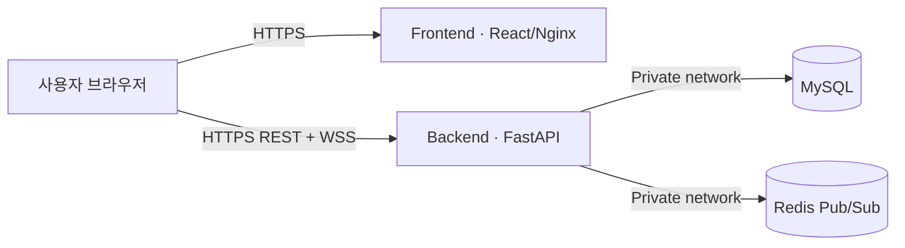

# Railway 배포 설명서

이 문서는 현재 `main` 브랜치의 통합 프로젝트를 Railway에 배포하는 절차다. 최종 구성은 네 서비스다.

## 기록된 배포 스냅샷

아래 표는 2026-08-01 당시 Railway Hobby 배포와 외부 종단 간 검증 기록이다. 현재 가동 여부와 연결 브랜치는 Railway 대시보드에서 다시 확인해야 한다.

| 항목 | 주소·상태 |
|---|---|
| Frontend | <https://frontend-production-8c41.up.railway.app> |
| Backend | <https://backend-production-98f3.up.railway.app> |
| Swagger | <https://backend-production-98f3.up.railway.app/docs> |
| MySQL | Railway private network, `SUCCESS` |
| Redis | Railway private network, `SUCCESS` |
| 당시 배포 브랜치 | GitHub `DB` |
| 배포 커밋 | `17ec8ca` |

실제 공개 주소에서 회원가입, CORS, MySQL 저장, JWT WebSocket 인증, 메시지 영속화를 검증했다. 현재 생성형 AI 제공자는 OpenAI만 사용하며, API 키가 없거나 호출이 실패하면 규칙 기반 응답으로 폴백한다.



## 1. 저장소에 포함된 배포 구성

| 파일 | 역할 |
|---|---|
| `/Dockerfile` | Python 3.13 기반 FastAPI 이미지 |
| `/railway.json` | 백엔드 빌드, DB 사전 마이그레이션, 상태 확인, 재시작 정책 |
| `/.dockerignore` | 백엔드 이미지에서 로컬·프런트 산출물 제외 |
| `/my-app/Dockerfile` | React 빌드 후 Nginx로 제공하는 프런트 이미지 |
| `/my-app/nginx.conf.template` | Railway `PORT` 수신 및 SPA 경로 처리 |
| `/my-app/railway.json` | 프런트 상태 확인과 재시작 정책 |

백엔드 배포 전 `python -m scripts.migrate_schema`가 실행된다. 빈 MySQL에는 전체 테이블을 만들고, 기존 DB에는 통합 과정에서 필요한 컬럼과 유니크 제약을 멱등 적용한다.

## 2. Railway 프로젝트 생성

1. Railway에서 새 프로젝트를 만든다.
2. `MySQL` 템플릿을 추가하고 서비스 이름을 `MySQL`로 둔다.
3. `Redis` 템플릿을 추가하고 서비스 이름을 `Redis`로 둔다.
4. GitHub 저장소 `20211400jiho/havruta-ai-tutor`의 `main` 브랜치로 빈 서비스를 두 개 추가한다.
5. 두 GitHub 서비스 이름을 각각 `Backend`, `Frontend`로 지정한다.

MySQL과 Redis는 외부 공개 TCP 주소가 아니라 같은 Railway 프로젝트의 참조 변수를 사용한다.

## 3. Backend 설정

`Backend > Settings`에서 다음을 지정한다.

| 설정 | 값 |
|---|---|
| Branch | `main` |
| Root Directory | `/` |
| Config as Code | `/railway.json` |

`Backend > Variables`에 다음을 넣는다. `JWT_SECRET_KEY`는 예시를 그대로 사용하지 않는다.

```dotenv
APP_ENV=production
DATABASE_URL=${{MySQL.MYSQL_URL}}
REDIS_URL=${{Redis.REDIS_URL}}
JWT_SECRET_KEY=openssl로_생성한_충분히_긴_무작위값
JWT_ALGORITHM=HS256
ACCESS_TOKEN_EXPIRE_MINUTES=10080
CORS_ORIGINS=https://프런트_공개_도메인
OPENAI_API_KEY=발급받은_OpenAI_API_키
OPENAI_MODEL=gpt-5.6-terra
OPENAI_REASONING_EFFORT=none
OPENAI_TIMEOUT_SECONDS=45
OPENAI_MAX_OUTPUT_TOKENS=700
AI_REQUESTS_PER_MINUTE=12
AI_REQUESTS_PER_DAY=200
RAG_MIN_SCORE=0.2
RAG_PROVIDER=auto
RAG_CURRICULUM_YEAR=2022
```

로컬 터미널에서 안전한 JWT 키를 만들 수 있다.

```bash
openssl rand -hex 32
```

아직 프런트 도메인이 없다면 최초 백엔드 배포에서는 `CORS_ORIGINS=http://localhost:5173`으로 두고, 5단계에서 반드시 교체한다. Backend의 Public Networking에서 공개 도메인을 생성한 뒤 `https://...` 주소를 기록한다.

## 4. Frontend 설정

`Frontend > Settings`에서 다음을 지정한다.

| 설정 | 값 |
|---|---|
| Branch | `main` |
| Root Directory | `/my-app` |
| Config as Code | `/my-app/railway.json` |

`Frontend > Variables`에는 Backend의 실제 공개 도메인을 넣는다. 이 값은 React 번들 빌드 시 포함되므로 변경 후 반드시 재배포해야 한다.

```dotenv
VITE_API_URL=https://백엔드_공개_도메인
VITE_WS_URL=wss://백엔드_공개_도메인
```

Frontend의 Public Networking에서도 공개 도메인을 생성한다.

## 5. CORS 마무리와 배포 순서

1. MySQL과 Redis가 실행 중인지 확인한다.
2. Backend를 배포하고 `/` 상태 확인이 성공하는지 확인한다.
3. Frontend를 배포하고 공개 도메인을 생성한다.
4. Backend의 `CORS_ORIGINS`를 Frontend의 정확한 `https://...` 도메인으로 바꾼다.
5. Backend 변경 사항을 배포한다.
6. 브라우저에서 회원가입, 로그인, 학습방 생성, 채팅을 확인한다.

여러 프런트 주소를 허용할 때는 쉼표로 구분한다.

```dotenv
CORS_ORIGINS=https://production.example.com,https://staging.example.com
```

## 6. 배포 후 확인

```bash
curl https://백엔드_공개_도메인/
curl https://백엔드_공개_도메인/docs
curl https://프런트_공개_도메인/health
```

정상 상태 API 응답은 다음과 같다.

```json
{"status":"ok","service":"havruta-ai-tutor","docs":"/docs"}
```

브라우저에서는 다음 흐름을 확인한다.

1. 서로 다른 두 계정을 만든다.
2. 첫 계정에서 학습방을 만들고 초대 코드를 복사한다.
3. 두 번째 계정으로 참여한다.
4. 두 브라우저에서 같은 방에 입장해 메시지가 즉시 보이는지 확인한다.
5. 새로고침 후 이전 메시지가 복원되는지 확인한다.

## 7. 동작 방식

- REST 요청은 `Authorization: Bearer <JWT>`로 인증한다.
- 브라우저 WebSocket은 연결 직후 첫 인증 메시지의 JWT를 검증하고, 방 소유자 또는 멤버만 허용한다. JWT는 URL 접근 로그에 남지 않는다.
- 채팅 메시지는 `room_chat_messages` 테이블에 저장된다.
- Redis가 연결되면 각 Backend 인스턴스가 Pub/Sub 이벤트를 받아 자신의 WebSocket 사용자에게 전송한다.
- Redis 장애 시 현재 Backend 인스턴스 내부 채팅으로 폴백하지만 다른 인스턴스 사용자에게는 전달되지 않을 수 있다.
- 생성형 응답은 OpenAI Responses API만 사용한다. `OPENAI_API_KEY`가 없거나 API 호출이 실패하면 세션이 중단되지 않도록 규칙 기반 답변으로 폴백한다.
- 진행 중인 AI 대화는 MySQL에서 복원되며, 사용자별 분당·일일 요청 한도와 출력 토큰 상한으로 공개 테스트 비용을 보호한다.
- RAG는 과목·학교급·학년·단원을 함께 필터링해 다른 학년 자료가 섞이지 않게 한다.
- `RAG_CURRICULUM_YEAR=2022`는 2022 원본 또는 2022 성취기준 매핑 자료만 허용한다. 로컬 `chroma_db/`는 Docker 이미지에서 제외되므로 전 과목 의미 검색을 배포하려면 Railway 영속 볼륨이나 외부 벡터 DB가 필요하다.

## 8. GitHub 자동 배포

Backend와 Frontend가 GitHub `main` 브랜치에 연결되어 있으면 해당 브랜치의 새 커밋으로 배포를 자동 트리거할 수 있다. 백엔드는 `/railway.json`, 프런트는 `/my-app/railway.json`의 watch pattern을 사용해 관련 코드 변경만 재배포한다.

운영에서는 직접 `main`에 푸시하기보다 기능 브랜치와 Pull Request, 테스트 통과 후 병합하는 흐름을 권장한다.

## 9. 전 과목 Chroma RAG 배포

Backend에 5GB 이상 영속 볼륨을 만들고 `/data`에 마운트한다. 로컬 인덱스는 Git에 올리지 않고 Railway CLI로 볼륨에 직접 전송한다.

```bash
npx -y @railway/cli login
npx -y @railway/cli link -p 6bd8e75c-a489-4402-a56e-f9ce71c649ea -e production -s Backend
npx -y @railway/cli volume files --volume backend-volume upload chroma_db /chroma_db --concurrency 8
```

업로드 완료 후 Backend 변수에 다음 값을 넣는다.

```dotenv
RAG_PROVIDER=chroma
RAG_CURRICULUM_YEAR=2022
CHROMA_DIR=/data/chroma_db
CHROMA_COLLECTION=havruta_math_all
CHROMA_REQUIRED=true
EMBEDDING_MODEL=intfloat/multilingual-e5-base
EMBEDDING_LOCAL_FILES_ONLY=true
```

Docker 이미지는 Chroma와 동일한 임베딩 모델을 포함한다. 시작 시 `scripts.verify_chroma`가 30만 건 이상과 9개 과목을 확인하며, 검증 실패 시 잘못된 폴백 서비스가 공개되지 않도록 Backend 시작을 중단한다. Railway 볼륨은 pre-deploy 단계에 마운트되지 않으므로 이 검사는 컨테이너 시작 명령에서 실행한다.

## 10. 운영 체크리스트

- Railway 변수에 실제 비밀값을 저장하고 `.env`를 커밋하지 않는다.
- Backend와 Frontend에 HTTPS 공개 도메인을 사용한다.
- MySQL 정기 백업과 복구 테스트를 설정한다.
- Railway 배포·애플리케이션 로그와 사용량 알림을 확인한다.
- 로그인 요청 제한, 감사 로그, Refresh Token 정책을 추가한다. AI 학습 요청 제한은 이미 적용돼 있다.
- `create_all` 기반 마이그레이션을 운영 규모에 맞춰 Alembic으로 전환한다.
- MySQL·Redis·애플리케이션 버전을 정기적으로 업데이트한다.
